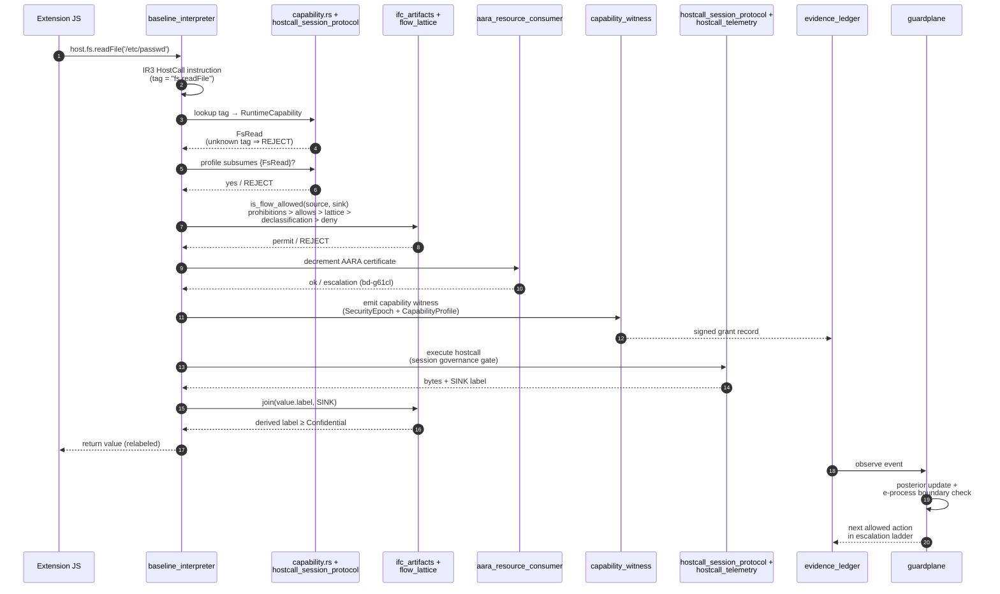
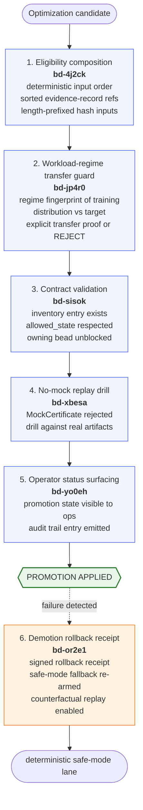
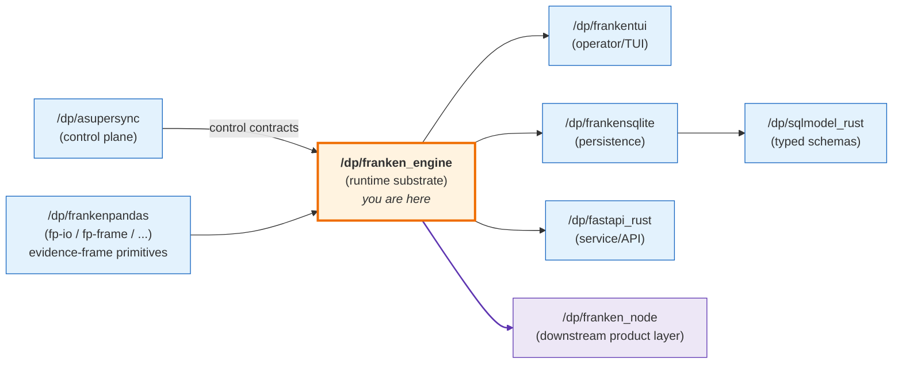

# FrankenEngine

<div align="center">
  
</div>

<div align="center">

[](https://www.rust-lang.org/)
[](https://doc.rust-lang.org/reference/unsafe-keyword.html)
[](./docs/RUNTIME_CHARTER.md)
[](./docs/CLAIM_TO_PROOF_MATRIX_V1.md)
[](./LICENSE)

</div>

A native Rust runtime for adversarial JavaScript/TypeScript extension workloads, built around four constitutional rules: native-only core execution (no V8/JSC/QuickJS bindings), deterministic replay of high-impact decisions, signed evidence for every containment action, and claim-language that cannot exceed its evidence.

### Why Each Constitutional Rule Exists

Each rule pays for itself by closing a class of failure that binding-led runtimes cannot close cheaply.

| Rule | Failure class it closes | Concrete mechanism |
|---|---|---|
| **Native-only core execution** (`Charter §2`) | Binding-led runtimes ship with megabytes of upstream unsafe C++/Zig that is *outside* the IFC/capability algebra. Retrofitting type-safe authority membranes around them is structurally lossy. | The lowering pipeline owns parser-to-scheduler semantics in Rust with `#![forbid(unsafe_code)]`. IFC labels are computed at IR2; capability checks gate every hostcall edge. |
| **Deterministic replay** (`Charter §3`) | Streaming policy decisions made under wall-clock pressure are not reproducible from a postmortem. Forensic causation breaks. | Replay captures the IR3 program, policy snapshot, model snapshot, evidence stream, and randomness transcript. The `bd-2488a` coverage gate fails closed unless every high-severity decision in the declared inventory replays byte-for-byte. |
| **Signed evidence for containment** (`Charter §3` + `§6`) | Containment actions taken without auditable evidence become indistinguishable from misconfiguration; rolling them back leaves no record that they happened. | Every evidence entry is Ed25519-signed with the originating runtime's key; chained `prev_hash` fields make any retroactive edit detectable; the artifact bundle ships with a `run_manifest.json` carrying schema id, host facts, content hashes, and operator-verification commands. |
| **Claim-language constraints** (`Charter §7`) | Documentation drifts ahead of evidence faster than evidence is rebuilt. README claims become marketing. | The `docs/CLAIM_TO_PROOF_MATRIX_V1.md` gate refuses prose whose actual wording state is stronger than `allowed_state` and emits exact `downgrade_text` for any violation. Forbidden absolute-superiority terms (`guarantees`, `unbreakable`, `always`, `proves`, `category-defining`, `>=Nx faster`) require backing artifacts. |

The rules compose. A containment action is replay-anchored *and* signed, so a counterfactual replay under a different policy snapshot can reconstruct what *would* have happened, and the result is itself signed evidence rather than a footnote.

---

## Project Status

This is research-grade infrastructure, not a packaged product.

- **No GitHub Releases, no version tags, no installer.** Source-build only. Single workspace version is `0.1.0`; "versioning" happens per artifact bundle, not per release. See [`CHANGELOG.md`](./CHANGELOG.md) for the actual evidence trail.
- **Every README claim is gated.** Any wording change runs through [`./scripts/run_claim_to_proof_matrix_gate.sh ci`](./scripts/run_claim_to_proof_matrix_gate.sh) against [`docs/claim_to_proof_matrix_v1.json`](./docs/claim_to_proof_matrix_v1.json). Claims classified `hypothesis` or `target` must say so explicitly; absolute-superiority language without artifacts is rejected.
- **Automation surfaces ship in advisory-only mode.** The shadow daemon and related automations cannot execute live mutations or production deployments until adoption gates are explicitly verified green. See [`docs/SHADOW_DAEMON_PROOF_STATE.md`](./docs/SHADOW_DAEMON_PROOF_STATE.md).

### Status Legend

Three qualifiers recur throughout this document. They carry binding meaning under [`docs/RUNTIME_CHARTER.md`](./docs/RUNTIME_CHARTER.md) §7 and are gated by [`./scripts/run_claim_to_proof_matrix_gate.sh ci`](./scripts/run_claim_to_proof_matrix_gate.sh). The authoritative ledger is [`docs/CLAIM_TO_PROOF_MATRIX_V1.md`](./docs/CLAIM_TO_PROOF_MATRIX_V1.md).

| Qualifier | Meaning | What it means for you |
|---|---|---|
| **OBSERVED** | Current artifacts and a verification command are linked. The strongest permitted wording. | Safe to rely on under the stated environment and inputs. |
| **TARGETED** | A design goal or SLO is documented, but observed proof is not linked yet. | Treat as a roadmap commitment, not a current guarantee. Plan accordingly. |
| **HYPOTHESIS** | Projected or optional behaviour that must not be read as shipped proof. | Do not build dependencies on this surface until it promotes. |

The gate fails when the actual wording state of a README sentence is stronger than the matrix's `allowed_state` for that claim, and emits exact `downgrade_text` for any violation. Forbidden absolute-superiority terms (`guarantees`, `unbreakable`, `always`, `proves`, `category-defining`, `>=Nx faster`) require backing artifacts.

### Recent Wins (Wave 4 — May 2026)

Most recent promotions and proof-bundle landings from the May 2026 cycle (see [`CHANGELOG.md`](./CHANGELOG.md) Wave 4 for the full list):

- **README hypothesis-claim promotion campaign** (IDEA-WIZARD-XIII, `bd-ly6hp`) shipped its six-child series wiring live proof bundles for every previously-hypothesised README claim, plus a no-mock acceptance drill (`bd-ly6hp.6`) that rejects fixtures.
- **Live quarantine-mesh proof wrapper** (`bd-ly6hp.3`) ships, narrowing the gap to OBSERVED on the fleet-immune SLO.
- **Capability-typed authority proof pilot** (`bd-ly6hp.4`) lands the first end-to-end ambient-authority rejection lane.
- **IDEA-WIZARD-XI promotion controller** (`bd-xg3d6` parent) closed all six children: eligibility composer (`bd-4j2ck`), workload-regime transfer guard (`bd-jp4r0`), promotion-control contract (`bd-sisok`), no-mock replay drill (`bd-xbesa`), operator-runbook status (`bd-yo0eh`), and demotion rollback + safe-mode replay receipts (`bd-or2e1`).
- **Real (non-simulated) hot-path proof lanes** (IDEA-WIZARD-X, `bd-t5k40`): `MockCertificate` and `hot_paths_simulation` artifacts are now rejected by the contract gate.
- **`franken-core` extracted modules** compile standalone for the first time (`bd-zsais` series): class semantics, async functions, async generators, accessor descriptors, heap-backed own-property storage.

### Versioning & Release Posture

The workspace ships at `0.1.0` across every Cargo manifest. That number is not going to move soon, and the *real* version of any given runtime behaviour, decision, or benchmark claim is its artifact bundle, not the Cargo version. Here is what that means in practice:

| Concept | What it is |
|---|---|
| **Workspace Cargo version** (`0.1.0`) | A pin that lets `cargo` resolve the crates. Not a release. Will be bumped only when a tagged GA exit lands. |
| **Backup tags** (`backup/main-tip-*`, `backup/worktree-tip-*`) | Periodic preservation tags so a future bisect can find a known-good point. Not releases. |
| **GitHub Releases** | None yet. The first will require the GA-exit evidence package (see *Acceptance Ledger & GA Exit Evidence*) to be complete, which in turn requires every matrix row to be either OBSERVED or explicitly downgraded. |
| **Artifact bundle version** (`franken-engine.proof-artifact-manifest.v1`) | The schema version that every gate's `run_manifest.json` carries. Bumped when the manifest shape changes; pinned by `SchemaId` in evidence records. |
| **`SchemaId`** (per persisted type) | Content hash of a schema definition. Automatically detects schema evolution; replay refuses to silently reinterpret old bytes under a new schema. |
| **Bead** (`bd-<base36>` in `.beads/issues.jsonl`) | The unit of work granularity. Every claim in the claim-to-proof matrix names a single owning bead; closing the bead is the unit of release-level change. |

The practical effect: if you ask "what version of FrankenEngine should I pin?", the right answer is **a specific commit SHA plus a specific artifact-bundle manifest**, not a semver string. Downstream consumers (e.g. `/dp/franken_node`) consume FrankenEngine by path-dep in Cargo.toml plus a documented commit SHA, not by a published crate version. That's also why `CHANGELOG.md` is organised into research-grouped capability waves instead of release headings.

When the GA-exit package becomes complete, the workspace will jump to a real tagged release and the artifact-bundle-versioning model will sit alongside conventional semver. Until then, treat per-artifact-bundle versioning as the system of record.

---

## Build From Source (Quick Start)

```bash
git clone https://github.com/Dicklesworthstone/franken_engine.git
cd franken_engine
cargo build --release -p frankenengine-engine --bin frankenctl
./target/release/frankenctl version
```

Then run the end-to-end smoke that exercises `compile` → `verify` → `run`:

```bash
FRANKENCTL_BIN=./target/release/frankenctl ./scripts/e2e/readme_cli_workflow_smoke.sh
```

Artifacts land under `artifacts/readme_cli_workflow_smoke/<timestamp>/` with a signed manifest, structured events, command transcript, and the emitted compile/run/replay payloads.

The workspace exposes five library crates and six release binaries:

| Cargo crate | Binary targets |
|---|---|
| `frankenengine-engine` | `frankenctl` (primary CLI), `franken-react-sidecar`, `franken-benchmark-evidence-export`, `franken-architecture-inventory`, `franken-decision-demo`, `franken-quarantine-mesh-demo` |
| `frankenengine-extension-host` | — (library only) |
| `frankenengine-test-support` | — (library only; mock control-plane adapters, latency/failure injection) |
| `frankenengine-control-plane-integration-tests` | — (library only; holds integration tests gated on `frankenengine-test-support`) |
| `frankenengine-metamorphic` | `run_metamorphic_suite`, `run_parser_metamorphic` (library + binaries; metamorphic-relation runner) |

The in-progress `franken-core` extraction crate sits under `crates/franken-core/` but is `exclude`-d from the workspace until its API boundary stabilizes (see `Cargo.toml` and the `bd-zsais` series in [`CHANGELOG.md`](./CHANGELOG.md)).

---

## TL;DR

### The Problem

Node and Bun are excellent general-purpose JavaScript runtimes, but extension-heavy agent systems and other adversarial workloads need a different default posture: active containment, deterministic forensics, explicit runtime authority boundaries, and claim language that can be defended with reproducible evidence. Retrofitting any of those into a binding-led engine is structurally painful.

### The Solution

FrankenEngine is a from-scratch Rust execution substrate where security, replay, and evidence are first-class concerns of the core pipeline rather than instrumentation around it. What ships today:

- a native baseline interpreter with `baseline_deterministic_profile`, `baseline_throughput_profile`, and an `adaptive_profile_router` for policy-driven lane selection;
- a probabilistic guardplane that updates Bayesian risk and crosses e-process boundaries to trigger `allow / challenge / sandbox / suspend / terminate / quarantine`;
- deterministic replay over a declared high-severity allow/deny/escalate inventory, plus byte-identical fixed-input `frankenctl compile` / `frankenctl run` artifacts proven in the CLI integration test;
- a binding **claim-to-proof matrix** that refuses to let documentation get ahead of the evidence.

### Where Each Capability Stands Today

The table below mirrors [`docs/CLAIM_TO_PROOF_MATRIX_V1.md`](./docs/CLAIM_TO_PROOF_MATRIX_V1.md). States carry binding meaning under `docs/RUNTIME_CHARTER.md` §7.

| Capability | State | What that actually means |
|---|---|---|
| Native execution profiles (`baseline_deterministic_profile`, `baseline_throughput_profile`, `adaptive_profile_router`) | OBSERVED | Live in tree, exercised by the CLI smoke and the RGC execution-profile gate. |
| Probabilistic guardplane (Bayesian + e-process boundaries) | OBSERVED | Backed by live decision artifacts; demonstrated in `examples/live_guardplane_decision_example.rs`. |
| Deterministic replay for the declared high-severity inventory | OBSERVED | `replay_coverage` proof gate (`bd-2488a`) + byte-identical fixed-input `compile`/`run` artifacts in CLI integration tests. |
| Cryptographic decision receipts with transparency-log + TEE attestation | HYPOTHESIS | Receipt, transparency-log, and TEE proof must be split and shipped before this can be promoted. |
| Fleet immune system / quarantine propagation convergence SLO | TARGETED | A live quarantine-mesh proof wrapper now exists (`bd-ly6hp.3`); bounded convergence SLOs remain target until that evidence is published. |
| Capability-typed end-to-end TS-to-IR contract / ambient-authority rejection | TARGETED | Selected runtime capability gates are present; the compile-time end-to-end contract is not shipped. |
| Information-flow control with signed declassification receipts | OBSERVED | Live IFC example in `examples/live_ifc_declassification_example.rs` (`bd-dpfvh`). |
| Red-team compromise-rate comparison | OBSERVED | Real attacker harness (`bd-28otw`), not hardcoded baselines. |
| Signal-to-action latency for containment | OBSERVED | Real latency artifacts; operational target is at or below 250ms median under defined load envelopes. |
| Cross-runtime Node/Bun denominator throughput | TARGETED | Hot-path workloads are real; Node/Bun denominator artifacts are still needed. `MockCertificate` / `hot_paths_simulation` artifacts are rejected by the gate. |
| Proof-carrying compilation, formal policy semantics, theorem-backed compiler | HYPOTHESIS | Tracked in the matrix and downgraded in-tree by `bd-csnqb`. |

---

## Reading Guide By Audience

This README is long because it serves several audiences. Below is a recommended first-pass route for each, roughly 15 minutes of reading. Pick your role and start with those six or seven sections before drilling further.

### If you are a security researcher

1. *Project Status*, to establish the trust posture.
2. *Threat Model*, for what's in scope vs out of scope.
3. *Security Model: Information-Flow Control* and *Security Model: Capability Algebra*, the finite algebras the runtime is built on.
4. *Walk-Through of a Hostcall*, the concrete enforcement path.
5. *Adversarial Testing Subsystem*, the harnesses that keep claims honest.
6. *Cryptographic Primitives & Determinism Discipline*, the trust roots.
7. *Donor Extraction Scope & Semantic Donor Spec*, what the runtime can and cannot import from V8/QuickJS.

### If you are an operator

1. *Project Status* and *Build From Source (Quick Start)*, for current state.
2. *Command Reference* (start with the *Quick Reference Card*), every `frankenctl` surface.
3. *Diagnostics & Doctor Surfaces*, preflight and incident triage.
4. *Gate Scripts and Evidence Workflow*, what to run and when.
5. *Artifact Bundle Anatomy* and *Acceptance Ledger & GA Exit Evidence*, what an incident-evidence pack looks like.
6. *rch Protocol* and *Troubleshooting*, survival skills for the build/test loop.
7. *Unsupported Surfaces*, what *not* to rely on in production.

### If you are a contributor

1. *AGENTS.md* (at the repo root, not in this README). Read it first.
2. *Architecture* and *Lifecycle of a `frankenctl run`*, the mental model.
3. *IR Pipeline Deep-Dive*, where most code edits land.
4. *Extending FrankenEngine*, the actual checklist for new modules / gates / claims.
5. *Testing & Quality Gate Layers* and *Fuzz Targets Catalogue*, what tests to write.
6. *Cryptographic Primitives & Determinism Discipline*, the no-`HashMap` / length-prefix rules.
7. *Beads Workflow & Project Memory*, how work is tracked.

### If you are a downstream consumer (`franken_node` or another sibling)

1. *Project Topology* and *Sibling Repositories (Binding Reuse Contract)*, where you sit in the constellation.
2. *Project Status* and *Production Readiness Checklist*, what you can rely on right now.
3. *Module System & Compatibility Matrix*, what the runtime accepts at the boundary.
4. *Performance Measurement Methodology*, what numbers you can quote.
5. *Claim-to-Proof Matrix* (`docs/CLAIM_TO_PROOF_MATRIX_V1.md`), what wording is gated.
6. *Gate Scripts and Evidence Workflow* and *Artifact Bundle Anatomy*, what to pull from a handoff bundle.

### If you are a benchmarker or claim-publisher

1. *Project Status* (specifically the claim-language gate), the rules.
2. *Performance Measurement Methodology*, the four hard rules.
3. *Bench Suite Anatomy*, what each benchmark category is for.
4. *Test & Mock Discipline*: no mock evidence, no fake denominator, no fixture passing as data.
5. *Cryptographic Primitives & Determinism Discipline*, why content hashes are length-prefixed.
6. The Claim-to-Proof Matrix itself (`docs/CLAIM_TO_PROOF_MATRIX_V1.md`).

### If you are an AI coding agent

`AGENTS.md` at the repo root is binding; read it first. Then this README's *Extending FrankenEngine* and *Beads Workflow & Project Memory* sections.

---

## Design Philosophy

1. **Runtime ownership over wrappers.** FrankenEngine owns parser-to-scheduler semantics in Rust. Compatibility is a product layer in `/dp/franken_node`, not a hidden wrapper around a third-party engine. `rusty_v8` / `rquickjs` / equivalent binding-led core paths are forbidden by `docs/RUNTIME_CHARTER.md` §2.
2. **Security and performance as co-equal constraints.** No correctness/speed trade and no speed/policy theater. Optimizations ship with behavior proofs and rollback artifacts (see `bd-or2e1` rollback receipts and `bd-jp4r0` transfer guards).
3. **Deterministic first, adaptive second.** Live decisions must replay deterministically from fixed artifacts. Adaptive learning is allowed only via signed promoted snapshots with explicit demotion paths.
4. **Evidence before claims.** Benchmarks, containment metrics, and policy assertions are tied to reproducible artifacts. No artifact, no claim. See [`docs/REPRODUCIBILITY_CONTRACT.md`](./docs/REPRODUCIBILITY_CONTRACT.md).
5. **Constitutional integration.** FrankenEngine reuses stronger sibling substrates rather than rebuilding them: `/dp/asupersync` control contracts, `/dp/frankentui` operator surfaces, `/dp/frankensqlite` and `/dp/sqlmodel_rust` persistence, `/dp/fastapi_rust` service surfaces. Parallel local replacements require explicit approval.

---

## Architecture

The core execution pipeline runs from source through a four-stage lowering into the baseline interpreter and orchestrator, with the evidence ledger collecting trace, decision, and audit records at every stage.

```
┌──────────┐   ┌──────────┐   ┌──────────┐
│  Source  │──▶│  Parser  │──▶│   AST    │
│  JS/TS   │   │parser.rs │   │  ast.rs  │
└──────────┘   └──────────┘   └─────┬────┘
                                    │
                                    ▼
┌───────────────────────────────────────────────────────────┐
│              Lowering Pipeline (lowering_pipeline.rs)     │
├──────────┬──────────┬──────────┬──────────────────────────┤
│   IR0    │   IR1    │   IR2    │           IR3            │
│ raw AST  │ scoped + │ control- │  register-allocated      │
│          │ symbols  │ flow SSA │  executable instructions │
└──────────┴──────────┴──────────┴────────────┬─────────────┘
                                              │
                                              ▼
       ┌────────────────────────────┐  ┌────────────────────────────┐
       │  Baseline Interpreter      │  │  Execution Orchestrator    │
       │  baseline_interpreter.rs   │─▶│  execution_orchestrator.rs │
       │  dispatch + GC + excpt.    │  │  epochs + budgets + caps   │
       └────────────────────────────┘  └─────────────┬──────────────┘
                                                     │
                                                     ▼
                                  ┌──────────────────────────────┐
                                  │      Evidence Ledger         │
                                  │      evidence_ledger.rs      │
                                  │  traces · decisions · audit  │
                                  └──────────────────────────────┘
```

A governance overlay (capability framework, security epochs, gate modules, fleet convergence) wraps every stage. Full diagram and component-by-component reference live in [`docs/ARCHITECTURE_OVERVIEW.md`](./docs/ARCHITECTURE_OVERVIEW.md); the generated module/gate/binary inventory is in [`docs/ARCHITECTURE_INVENTORY.md`](./docs/ARCHITECTURE_INVENTORY.md).

### Code Surface At A Glance

| Surface | Count / size |
|---|---|
| Source modules in `crates/franken-engine/src/` | 511 (`baseline_interpreter.rs` alone is ~1.25 MB / 31,730 LoC) |
| Internal operator binaries in `crates/franken-engine/src/bin/` | 57 |
| Integration tests in `crates/franken-engine/tests/` | 1,382 files (37 are RGC gate tests) |
| Operator gate scripts in `scripts/run_*.sh` | 241 (56 RGC, 36 parser, 34 FRX, the rest claim/evidence/build plumbing) |
| Replay wrappers in `scripts/e2e/*_replay.sh` | 158 (83 have an exact `<gate>_replay.sh` partner to a `run_<gate>.sh`; the remaining 75 cover composite or sub-gate replay shapes) |
| Architecture / contract docs in `docs/` | 672 top-level files (`*.md` + `*.json` contracts) plus `docs/architecture/`, `docs/adr/`, `docs/plans/`, `docs/templates/`, `docs/operator-gates/` |
| Impossible-by-default demos under `examples/` | 13 capabilities, 20 numbered demo directories (`01_…` – `22_…` with gaps) |
| Tracked beads in `.beads/issues.jsonl` | 2,584 issues (open + closed); see `memory/enrichment_sessions.md` for the lib-test landing journal (35,000+ unit tests recorded by 2026-03-19) |
| Cargo fuzz harnesses | 30 across two trees: 17 in top-level `fuzz/fuzz_targets/` + 13 in `crates/franken-engine/fuzz/fuzz_targets/` |
| Benchmark suites in `benchmarks/` | `macro/`, `micro/`, `runtime_comparison/` |

### Workspace Layout

```
franken_engine/
├── Cargo.toml                       # Workspace; franken-core is excluded pending extraction
├── AGENTS.md                        # Hard rules for AI coding agents
├── CHANGELOG.md                     # Synthesized 4-month history
├── crates/
│   ├── franken-engine/              # Engine core: parser, IR, interpreter, orchestrator, 511 modules
│   │   ├── src/bin/frankenctl.rs    # Primary CLI (+ 56 internal operator binaries)
│   │   ├── src/baseline_interpreter.rs   # Core VM (31,730 LoC)
│   │   ├── benches/                 # comparative_node, comparative_bun, hot_paths
│   │   └── tests/                   # 1,382 integration tests (37 RGC gate tests)
│   ├── franken-extension-host/      # Ed25519-signed extension manifests + capability model
│   ├── franken-engine-test-support/ # Mock control-plane adapters + injection helpers
│   ├── franken-engine-control-plane-integration-tests/ # Holds tests gated on test-support
│   ├── franken-metamorphic/         # Metamorphic-relation runner (whitespace, roundtrip, equivalence)
│   └── franken-core/                # In-progress extracted runtime; excluded from workspace
├── docs/                            # Charters, contracts, audits, gate specs (672 top-level files + subdirs)
├── examples/                        # 13 impossible-by-default capability demos + live runtime examples
├── scripts/                         # 241 run_*.sh gate runners + e2e/*_replay.sh wrappers
├── runbooks/                        # Incident-evidence collector + emergency rollback
├── fuzz/                            # cargo-fuzz harnesses (parser, ts_module_resolution, shadow_panel)
├── benchmarks/                      # Benchmark inputs and goldens
├── artifacts/                       # Timestamped gate output bundles (gitignored)
├── legacy_quickjs/, legacy_v8/      # Reference corpora ONLY (never runtime deps)
└── LICENSE                          # MIT
```

---

## Lifecycle of a `frankenctl run`

Tracing one invocation end-to-end is the fastest way to see how every subsystem connects. Starting from `./target/release/frankenctl run --input ./demo.js --extension-id demo-ext --out ./artifacts/demo.run.json`:

```
                 ┌──────────────────────────────────────────┐
       ./demo.js │ 1.  CLI parses args (clap derive)        │
       ─────────▶│     bin/frankenctl.rs                    │
                 └──────────────┬───────────────────────────┘
                                ▼
                 ┌──────────────────────────────────────────┐
                 │ 2.  Source ingested; goal = script       │
                 │     parser.rs                            │
                 │     · tokens via simd_lexer              │
                 │     · token_witness_hash mixes input     │
                 │     · parser_arena allocates AST nodes   │
                 └──────────────┬───────────────────────────┘
                                ▼
                 ┌──────────────────────────────────────────┐
                 │ 3.  AST -> IR0 -> IR1 -> IR2 -> IR3      │
                 │     lowering_pipeline.rs                 │
                 │     · symbol/scope resolution            │
                 │     · control-flow normalization (SSA)   │
                 │     · IR3 = register-allocated dispatch  │
                 └──────────────┬───────────────────────────┘
                                ▼
                 ┌──────────────────────────────────────────┐
                 │ 4.  ExecutionOrchestrator opens a cell   │
                 │     · SecurityEpoch::from_raw()          │
                 │     · CapabilityProfile attenuation      │
                 │     · ResourceBudget bound to enforcer   │
                 └──────────────┬───────────────────────────┘
                                ▼
                 ┌──────────────────────────────────────────┐
                 │ 5.  Baseline interpreter dispatches IR3  │
                 │     · receiver-aware builtin lookup      │
                 │     · IFC label join on derived values   │
                 │     · hostcall capability check on edges │
                 └──────────────┬───────────────────────────┘
                                ▼
                 ┌──────────────────────────────────────────┐
                 │ 6.  Guardplane observes events           │
                 │     · Bayesian posterior update          │
                 │     · e-process boundary check           │
                 │     · expected-loss vs action threshold  │
                 │     -> allow / challenge / sandbox /     │
                 │        suspend / terminate / quarantine  │
                 └──────────────┬───────────────────────────┘
                                ▼
                 ┌──────────────────────────────────────────┐
                 │ 7.  Evidence ledger records each step    │
                 │     · TraceEntry, DecisionRecord, audit  │
                 │     · length-prefixed canonical hashing  │
                 │     · chained content hashes             │
                 └──────────────┬───────────────────────────┘
                                ▼
                 ┌──────────────────────────────────────────┐
                 │ 8.  Execution report emitted             │
                 │     ./artifacts/demo.run.json            │
                 │     · byte-identical for fixed inputs    │
                 │     · CLI smoke verifies via diff        │
                 └──────────────────────────────────────────┘
```

The smoke wrapper `scripts/e2e/readme_cli_workflow_smoke.sh` exercises steps 1–8 with a frozen input, then diffs the output against the recorded golden. That is the proof behind the OBSERVED `FE-CLAIM-007` and `FE-CLAIM-013` claims.

---

## IR Pipeline Deep-Dive

The lowering pipeline progresses through four intermediate representations, each narrower than the last:

| Stage | What it carries | Key invariants enforced here |
|---|---|---|
| **IR0 — raw AST** | Lossless syntax tree (`Ir0Node`) with source spans, comments, JSX/TSX surfaces. | Parse goal (`script` vs `module`), source-position fidelity, donor-extraction allowlist compliance. |
| **IR1 — normalized** | Scope/symbol tables resolved, declarations hoisted, identifiers bound. `Ir1Instruction` set includes the iterator-protocol opcodes (`ForInInit`, `ForInNext`, `ForOfInit`, `ForOfNext`, `IteratorClose`). | Static-semantics rules, TDZ correctness, declaration-before-use, named-export-clause validity. |
| **IR2 — simplified** | Control-flow lowered into basic blocks with SSA-ish form (`Ir2Block`). Tagged-template expressions desugar to `Call` with a template-literal argument; exception lowering inserts `BeginTry` / `EnterCatch` / `EnterFinally` / `EndFinally`. | IFC join on derived data, exception unwinder shape, lowering-gap truth invariant (status fields cannot disagree). |
| **IR3 — executable** | Register-allocated dispatch (`Ir3Instruction`) ready for the baseline interpreter. Includes the 19 expansion variants added in Wave 2 (`Mod`, `Exp`, `Lt`/`Lte`/`Gt`/`Gte`, `Eq`/`StrictEq`/`NotEq`/`StrictNotEq`, `BitAnd`/`BitOr`/`BitXor`, `Shl`/`Shr`/`Ushr`, `InstanceOf`, `InOp`, `Construct`) and TemplateLiteral emission. | Stack/register frame integrity, mnemonic completeness in `execution_orchestrator.rs`, baseline-interpreter match-arm exhaustiveness. |

Two contracts guard the pipeline shape:

- **Lowering Gap Truth Invariant** (`docs/LOWERING_GAP_TRUTH_INVARIANT_V1.md`): the `status`, `parser_ready_syntax`, `execution_ready_semantics`, and prose fields of the lowering gap inventory cannot encode mutually incompatible states. Gate: `./scripts/run_lowering_gap_truth_invariant.sh ci`.
- **Parser Phase0 Artifact Contract** (`docs/PARSER_PHASE0_ARTIFACT_CONTRACT_V1.md`): rejects placeholder performance artifacts and demands explicit degraded-mode receipts when real capture fails. Gate: `./scripts/run_parser_phase0_artifact_contract.sh ci`.

---

## JavaScript Language Surface Coverage

The runtime ships a bounded JavaScript surface. The current state is recorded in two self-documenting inventories that the runtime itself validates.

### Self-Documenting Inventories

| Inventory | Purpose | Truth gate |
|---|---|---|
| `parser_gap_inventory.rs` | Per-construct status of the parser front-end. Each entry has `parser_ready_syntax` + prose. | `./scripts/run_parser_phase0_artifact_contract.sh ci` |
| `lowering_gap_inventory.rs` | Per-construct status of the IR0 → IR3 lowering pipeline. Each entry has `status`, `parser_ready_syntax`, `execution_ready_semantics`, and prose. | `./scripts/run_lowering_gap_truth_invariant.sh ci` |

The Lowering Gap Truth Invariant (`docs/LOWERING_GAP_TRUTH_INVARIANT_V1.md`) enforces that the four fields cannot encode mutually incompatible states. If `parser_ready_syntax = true` and the prose says "not yet parsed", the gate fails. The language-surface coverage table below is therefore self-consistent with the running code and cannot drift silently.

### High-level coverage today

| Feature family | Status | Notes |
|---|---|---|
| ES2020 module loader | Lowered | Star re-exports, conditional `exports`-map resolution, npm-style extension probing in `bun_compat`; fail-closed extensionless imports in `native` / `node_compat`. |
| Classes (declarations + expressions) | Executed | Class expressions, `extends`/`super` dispatch, `new.target`, accessor `get`/`set` descriptor invocation, private-accessor prefix tagging. (`bd-…` series in `franken-core`, May 2026.) |
| Async functions | Executed | Full async body execution (`bd-2lg6f`); pending-await IFC labels preserved (`bd-jcqqj`). |
| Generators + async generators | Executed | `.next()` body execution (May 2026); Generator/Async/AsyncGenerator dispatch in the baseline interpreter. |
| `for..in` / `for..of` | Lowered | Iterator-protocol IR1 opcodes (`ForInInit`, `ForInNext`, `ForOfInit`, `ForOfNext`, `IteratorClose`) replace earlier UnsupportedSyntax placeholders. |
| Try / catch / finally | Lowered | Function-body try/catch/finally with `BeginTry` / `EnterCatch` / `EnterFinally` / `EndFinally`; runtime unwinder (`CatchFrame`, `FinallyMode`, `pending_exception`). |
| Throw / exception semantics | Executed | 13 exception-semantics conformance tests; cross-layer error metadata frozen by `run_rgc_exception_diagnostics_semantics.sh`. |
| Tagged-template expressions | Parsed + lowered | `Call` with template-literal argument; trailing line comments stripped; unseparated expression sequences rejected. |
| Promise / microtask | Executed | `Promise.all` delegated to combinator; promise model in `promise_model.rs`. |
| Map / Set / WeakMap / WeakSet | Executed | Seeded from iterables; underlying storage is `BTreeMap` for determinism. |
| Array iteration helpers | Executed | `Array.from(iterable, mapFn, thisArg)`, `Array.some` real-callback dispatch, `reduceRight`. |
| Number / BigInt | Executed | Standard ES coercions; overflow-safe saturating arithmetic on internal counters. |
| Regex | Executed | Standard JS regex semantics; the `regexp-governance` policy chooses `KnownGap` over insufficient evidence. |
| JSON.parse / JSON.stringify | Executed | Compound traversal proof lane (`run_rgc_json_stringify_compound_traversal.sh`) demonstrates real heap-backed compound values, not placeholder strings. |
| Reflection / Symbols / Proxies | Partial | Coverage tracked in the gap inventory; not all reflection surfaces are executed yet. |
| Top-level `await` | Lowered | Async module evaluation dependency tracking (`bd-…`, March 2026). |
| `eval` / `Function()` | Restricted | The capability gate refuses dynamic-code execution by default; opt-in via explicit capability grant. |
| `import.meta` | Fail-closed at parser | Listed in the gap inventory; deliberate refusal pending a typed contract. |
| `WebAssembly` | Out of scope for the JS lane | Has its own runtime lane (`wasm_runtime_lane.rs`); not yet exposed via the JS module loader. |

This list is not exhaustive; it is the operator-facing summary. The authoritative state is the lowering-gap inventory at HEAD.

### `parser_gap_inventory.rs` and `lowering_gap_inventory.rs` as a pattern

The gap-inventory pattern recurs across the runtime: the implementation itself ships a list of "what is and isn't done" against a typed contract, and a gate refuses status drift. The two language-surface inventories above are the most visible instances, but the pattern is also used for:

- `architecture_inventory.rs`: module counts, lib.rs exports, gate counts, binary list. Regenerated by the `franken-architecture-inventory` binary.
- `placeholder_closure_verification`: every audited placeholder/mock/stub finding plus its closure status.
- `audit_closure_matrix.rs`: every closed gate-audit and the evidence that closed it.

The discipline: if something is "not done", it must be enumerable, and the gate must fail closed when the enumeration drifts from the code.

---

## Security Model: Information-Flow Control

`docs/FORMAL_RUNTIME_SECURITY_MODEL_V1.md` pins the IFC layer to a finite, executable algebra rather than a theorem-backed claim. The runtime supports a fixed lattice:

```
Public  <  Internal  <  Confidential  <  Secret  <  TopSecret
```

Custom labels extend the carrier set with an explicit non-negative level via `Label::level()`. Source `s` may flow to sink `k` only when `s <= k` under that order. The join and meet are level-ordered:

- `join(a, b) = max_level(a, b)`, so derived data is at least as sensitive as any direct input.
- `meet(a, b) = min_level(a, b)`, the greatest lower bound under `<=`.

The shipped invariant tests (`cargo test -p frankenengine-engine --lib ifc_lattice_model`) enforce idempotence, commutativity, associativity, and absorption over the built-in label set.

`FlowPolicy::is_flow_allowed(s, k)` resolves in this fixed order:

1. Explicit prohibitions deny first (even if `s <= k`).
2. Explicit allow-entries permit named exceptions.
3. Lattice-legal flows permit (`s <= k`).
4. Declassification routes return `RequiredDeclassification`.
5. Everything else denies (fail-closed default).

Declassification is mediated by signed receipts (`bd-dpfvh`, demo: `examples/live_ifc_declassification_example.rs`); the runtime records each declassification with its authorizing capability witness, source/sink labels, content binding, and timestamp bounds (added Apr 2026 via `feat(ifc): Add timestamp bounds to declassification receipts`).

---

## Security Model: Capability Algebra

Capability authority is also kept inside a finite algebra over `RuntimeCapability` variants. A `CapabilityProfile` denotes a subset of the variant set; subsumption is set inclusion and attenuation is set intersection.

```
A subsumes B   iff   B.capabilities  subset_of  A.capabilities
attenuate(A, B) = A intersect B
```

The shipped canonical profiles partition authority into disjoint zones:

| Profile | Role | Notes |
|---|---|---|
| `FullCaps` | Top of the lattice. | Subsumes every canonical profile. |
| `EngineCoreCaps` | Engine-internal hostcalls. | Pairwise intersection with `PolicyCaps` and `RemoteCaps` is empty. |
| `PolicyCaps` | Policy/governance surfaces. | Authority partitioned from engine-core and remote. |
| `RemoteCaps` | Cross-host / remote computation registry. | Authority partitioned from engine-core and policy. |
| `ComputeOnlyCaps` | Bottom of the lattice. | Grants no side effects; safe default for unknown extensions. |

Hard rules enforced by `cargo test -p frankenengine-engine --lib capability_profile_security_algebra`:

- Intersection is commutative, idempotent, and never grants capabilities absent from either input.
- Deserialization validates canonical profile definitions and rejects profile-kind / capability smuggling.
- Unknown hostcall tags map to no typed capability and are rejected by any caller that requires a security capability.

The end-to-end "capability-typed extension contract" (compile-time TS-to-IR rejection of ambient-authority constructs) is still **TARGETED**, not observed. The shipped runtime gates cover selected hostcall/import boundaries (`bd-1bao8`, `examples/21_live_capability_rejection`).

---

## Threat Model

What FrankenEngine *is* built to defend against, and what is explicitly out of scope. The list is taken from `docs/FORMAL_RUNTIME_SECURITY_MODEL_V1.md`, the Charter, and the donor-extraction scope.

### In scope: what the runtime defends against

| Threat | Defense |
|---|---|
| **Adversarial extension code attempting unauthorized hostcalls** | Capability algebra: every hostcall maps to at most one typed `RuntimeCapability`; unknown tags are rejected at the membrane. Selected runtime capability gates are OBSERVED; the end-to-end compile-time TS-to-IR contract is TARGETED. |
| **Information leakage across confidentiality boundaries** | IFC lattice (`Public < Internal < Confidential < Secret < TopSecret`); join on derived data; declassification only through signed receipts (`bd-dpfvh`). |
| **Resource exhaustion / DoS by extension** | `aara_resource_certificate.rs` quotas + `resource_escalation_control.rs` deterministic escalation (`bd-g61cl`). Containment funnels into the same guardplane that handles security events. |
| **Decision tampering / log forgery** | Evidence ledger: chained content hashes + Ed25519 signatures per entry; rewriting one entry invalidates every downstream `prev_hash`. |
| **Replay forgery / out-of-order replay** | Length-prefixed canonical hashing across every variable-length field; randomness transcript captured; `strict` replay aborts on first divergence. |
| **Promotion-of-unproven-optimizations / phantom promotions** | IDEA-WIZARD-XI promotion controller: eligibility composer (`bd-4j2ck`), transfer guard (`bd-jp4r0`), no-mock replay drill (`bd-xbesa`), demotion rollback receipt (`bd-or2e1`). |
| **Cross-runtime divergence under same input** | Test262 conformance (real, not fake fixtures), lockstep oracle, byte-level cross-runtime output equivalence in `benchmark-e2e`. |
| **Adversarial supremacy / worst-case input synthesis** | `adversarial_supremacy_synthesis.rs`, `attack_surface_game_model.rs`, `counterexample_synthesizer.rs`, fault-injection chaos pack. |
| **Native add-on supply-chain compromise** | `native_addon_membrane.rs` + cohort gate + parity gate; no "trusted native" path. |
| **Documentation drift / unbacked claims** | Claim-to-Proof Matrix gate: refuses prose whose actual wording state is stronger than `allowed_state`. |

### Out of scope: what FrankenEngine does NOT promise

| Out-of-scope threat | Why |
|---|---|
| **Side-channel attacks on the underlying CPU** (Spectre/Meltdown/RowHammer variants) | Hardware-side; FrankenEngine assumes the CPU honors its ISA contract. |
| **Compromised operator signing key** | Threshold signing (`threshold_signing.rs`) reduces blast radius but cannot defend against a multi-party compromise. Out-of-band key custody is required. |
| **Compromised host OS / hypervisor** | Bounded by TEE attestation, but TEE-backed production guarantees remain HYPOTHESIS (`FE-CLAIM-004`). |
| **Adversarial sibling-repo crates** | The sibling-reuse contract assumes `/dp/asupersync`, `/dp/frankentui`, `/dp/frankensqlite` are trusted upstream. Sibling-repo compromise is out of scope; the cross-repo integration suite verifies behaviour, not authenticity. |
| **De-escalation in a hostile fleet** | Quarantine is a permanent ratchet today; an extension that should be re-admitted after a false positive requires manual intervention. |
| **Formal end-to-end proofs** | The finite-algebra invariant tests are mathematically explicit; theorem-backed proofs of equivalence between specification and implementation remain HYPOTHESIS (`FE-CLAIM-016`–`FE-CLAIM-021`). |
| **Performance under unmeasured workloads** | Performance claims are gated to the `real_runtime_hot_paths` corpus. Behaviour outside that corpus is uncharacterised. |
| **Compatibility with arbitrary npm native add-ons** | Conservative posture: the membrane refuses to silently bridge an npm-style native add-on into the trust boundary. |

The gap between "in scope" and "out of scope" is intentionally explicit. The goal is to be *trustworthy under the stated threat model*, not *invincible across all conceivable threats*.

---

## Walk-Through of a Hostcall

A hostcall is the only way control or data leaves a JavaScript context. Tracing one (say, an extension trying to call `host.fs.readFile('/etc/passwd')`) shows every membrane the runtime erects.



A few things to notice:

- **No bypass path.** Steps 2–5 each have explicit fail-closed defaults. A missing capability profile, missing flow policy, or missing budget all reject the call.
- **Evidence is non-negotiable.** Step 9 is part of the call, not a logger that can be turned off.
- **Replay-safe.** Every input to the decision (capability profile id, flow policy id, AARA certificate id, security epoch) is content-hashed and recorded; a replay reads the same inputs and must reach the same decision.
- **Composes with the guardplane.** Step 10 is what makes a *pattern* of hostcalls (not just one) actionable for containment.

Tagged hostcalls and their `RuntimeCapability` mappings are the namespace boundary between the extension's view of "what it can call" and the runtime's view of "what authority that call requires". A new hostcall is *not* a code change in the extension API; it requires a new typed capability variant and a new typed entry in the dispatch.

---

## Guardplane Decision Model

The probabilistic guardplane is the runtime's continuous policy supervisor. It observes the event stream emitted by the orchestrator, updates a posterior over per-extension risk, and applies a fixed escalation ladder when the posterior crosses an e-process boundary or the expected-loss action threshold is exceeded.

### Decision ladder

```
allow  →  challenge  →  sandbox  →  suspend  →  terminate  →  quarantine
```

Each step is one-way under the current implementation (`bd-or2e1` demotion-rollback work made the *promotion* side reversible via signed receipts, but operational de-escalation across extensions is still unimplemented; quarantine is a permanent ratchet today).

### Bayesian posterior

`bayesian_posterior.rs` keeps a calibrated belief distribution over risk states. On each event the posterior updates via Bayes' rule against the policy-declared likelihood model; calibration drift is monitored by the `bayesian_error_recovery.rs` module so a miscalibrated prior fails closed rather than silently mispredicting.

### e-process boundaries

Sequential-testing boundaries (e-processes) bound the false-discovery rate over arbitrary stopping times, which is the right primitive for "we may decide to escalate at any moment". When the running test statistic crosses its boundary, the guardplane is permitted to take a containment action; otherwise it must defer. This avoids the multiple-comparisons trap that fixed-α tests would have under streaming evidence.

### Expected-loss decision rule

The action chosen at each crossing minimizes the policy's expected loss matrix: cost of false escalation vs cost of false continuation, scaled by the current posterior. The matrix is policy-declared, not hardcoded; `bd-69kbi` removed the last hardcoded containment-latency assumptions in April.

### Promotion / demotion control loop

The IDEA-WIZARD-XI series (`bd-xg3d6` parent, May 2026) built an explicit promotion controller around this model:

- `bd-sisok`: promotion-control contract and inventory
- `bd-4j2ck`: deterministic promotion-eligibility composer
- `bd-jp4r0`: workload-regime transfer guard (a model trained on one regime cannot promote into another without an explicit transfer proof)
- `bd-or2e1`: demotion rollback + safe-mode replay receipts
- `bd-yo0eh`: promotion-state surfacing in the operator runbook
- `bd-xbesa`: no-mock promotion-control replay drill and truth gate

The live demo is `examples/live_guardplane_decision_example.rs`.

---

## Deterministic Replay & Length-Prefix Hashing

Deterministic replay is the runtime's primary forensic primitive. The contract is **identical replay from fixed code, policy, model snapshot, evidence stream, and randomness transcript**.

### What is captured

Per-execution, the engine records:

- the IR3 program (content-hashed)
- the policy snapshot (content-hashed)
- the model snapshot for any adaptive component (content-hashed)
- the evidence stream (`events.jsonl` with chained content hashes)
- the randomness transcript (any non-determinism sources: clock reads, RNG draws, scheduler choices)

### Length-prefixed canonical hashing

A recurring motif across every wave of the project: any time a content hash mixes variable-length data, fields are *length-prefixed* before being concatenated into the hash input. Without that, two distinct decompositions of the same byte stream collide. Examples landed across the project:

- `GateResult` variable-length fields (May 2026, `290f5558`)
- `GovernanceReport` schema_version + spec_id (May 2026, `800b5c0e`)
- Support-bundle evidence entries (May 2026, `ed66b826`)
- React package cohort hash inputs (May 2026, `bb2ed417`)
- Hole-witness generator inputs (May 2026, `660ae476`)
- Hardware parameter manifold inputs (May 2026, `961b9794`)
- AOT entrygraph compiler inputs (May 2026, `4f7bdabe`)
- Conformance harness failure-id and repro-digest inputs (May 2026, `bccc9c57`)
- Elision-receipt array boundaries (March 2026, `f148f1a0`)
- Rewrite-pack canonical pair keys (March 2026, `1bf264a8`)
- Generic deterministic-content-hashing sweep (March 2026, `e8ed383c`, `d67bfe06`)

### Replay coverage gate

`bd-2488a` introduced the **replay coverage metric gate**. It fails closed unless the declared high-severity allow/deny/escalate inventory has:

- verified evidence entries
- matching hashes between recorded and replayed runs
- `strict` replay status (not `validate`-only)
- complete evidence fields (no NULLs in required positions)

Run: `./scripts/run_replay_coverage_metric_gate.sh ci`.

The CLI surface for replay is `frankenctl replay run --mode strict|validate --trace <path> [--compare-trace <path>]`. `strict` mode aborts on the first divergence; `validate` records all divergences for triage.

### Counterfactual replay

`counterfactual_evaluator.rs` answers "what would the runtime have done under policy snapshot X instead of Y?" against a captured trace. The original event stream and randomness transcript are fixed; only the policy snapshot is substituted. The output is a signed counterfactual decision record that ships alongside the original, so operators can audit a containment without ever applying the alternative policy in production.

---

## Evidence Ledger Anatomy

`evidence_ledger.rs` is the canonical sink for everything the runtime decides. The fields below describe the *shape* of an entry. See `evidence_contract.rs`, `evidence_emission.rs`, and `evidence_ordering.rs` for the exact serde types and ordering rules, and `evidence_replay_checker.rs` for the replay-equivalence checker.

```
{
  "schema_id":   "franken-engine.evidence-record.v1",
  "trace_id":    "trace-…",
  "decision_id": "decision-…",
  "policy_id":   "policy-…",
  "epoch":       <SecurityEpoch::as_u64()>,
  "kind":        "TraceEntry" | "DecisionRecord" | "AuditEvent" | "Receipt",
  "payload":     { /* kind-specific, content-bound */ },
  "content_hash":  <Sha256 of length-prefixed canonical encoding>,
  "prev_hash":     <content_hash of the previous entry in this trace>,
  "signed_by":     <Ed25519 verification key id>,
  "signature":     <Ed25519 signature over content_hash + prev_hash>,
  "generated_unix_ns": <i128>
}
```

Chained content hashes give cheap tamper detection: rewriting any entry invalidates every downstream `prev_hash`. The Ed25519 signature requires the originating runtime's signing key, so a stolen entry cannot be re-anchored into another ledger.

Decision records additionally include:

- the input event sketch that triggered the decision
- the guardplane posterior at decision time
- the e-process boundary state and the expected-loss matrix entry
- the chosen action and its capability witness
- any pre-emption / rollback receipt id (for promotion-controller decisions)

The `franken-engine.proof-artifact-manifest.v1` schema wraps a bundle of evidence records, the `commands.txt` transcript, the structured `events.jsonl`, and per-step logs into the artifact bundle described in **Artifact Bundle Anatomy** below.

---

## React / FRX Compilation Pipeline

FrankenReact eXtension (FRX) is the React/JSX/TSX compatibility track. It is a peer of the JavaScript runtime: same lowering pipeline, same evidence emission, but with React-specific source forms, runtimes, targets, and a fail-closed compile-vs-fallback policy.

### Source forms, runtimes, and targets

```
                  source form              runtime               target
                  ────────────             ─────────             ───────
                  jsx        ─┐         ┌─ classic     ─┐    ┌─ ssr
frankenctl react  tsx        ─┼─ × ─ ───┤              ─┼─ ─┤  client
                  jsx-frag    ┘         └─ automatic   ─┘    └─ hydration
```

- **`frankenctl react compile`** lowers a single source file under a chosen `--source-form` and `--runtime`. `jsx-fragment` is a degenerate form (no runtime required).
- **`frankenctl react build`** drives a multi-file FRX build to one of three `--target`s: `ssr`, `client`, or `hydration`.
- **`frankenctl react doctor`** consumes a React component catalog and emits operator artifacts (`--summary`, `--current-epoch`, `--min-severity`, `--target` filters, `--include-resolved`).
- **`frankenctl react contract`** emits the React compile/build contract artifact for downstream consumption.

### Gates in the FRX family (34 `run_frx_*.sh` scripts)

- **`run_frx_canonical_react_behavior_corpus_*.sh`**: canonical behavior corpus (`docs/frx_canonical_react_behavior_corpus_v1.json`) for output equivalence.
- **`run_frx_ssr_hydration_rsc_compatibility_strategy_suite.sh`**: SSR/hydration/RSC compatibility strategy; the operator-facing strategy contract for fail-closed React mode boundaries.
- **`run_frx_local_semantic_atlas_suite.sh`**: local semantic atlas covering supported JSX/TSX surfaces.
- **`run_frx_track_d_wasm_lane_hybrid_router_sprint_suite.sh`**: Track D, WASM lane + hybrid router experimentation.
- **`run_frx_track_e_verification_fuzz_formal_coverage_sprint_suite.sh`**: Track E, verification/fuzz/formal coverage.
- **`run_frx_online_regret_change_point_demotion_controller_suite.sh`**: online regret minimization + change-point detection driving demotion of misbehaving optimizations.

### Compile-vs-Fallback policy

`docs/frx_compile_vs_fallback_v1.json` pins the compile-vs-fallback decision: if the FRX compiler cannot lower a construct soundly, it must fall back to a documented degraded mode rather than emit unsafe output. The exit code from `frankenctl react compile|build` is `Blocked` in those cases, and downstream gates propagate the block so the artifact bundle records a fail-closed receipt rather than a silent emission (`6cde8fd8 feat(engine): propagate blocked exit code from react compile/build and pin replay contract`).

### React doctor diagnostics

`frankenctl react doctor` is the operator's tool for catalog-level triage. It reads a React component catalog (typically the output of a build run), classifies issues by severity, and filters by target (`--target ssr|client|hydration`) and minimum severity. It surfaces unresolved issues by default; `--include-resolved` widens to historical state for audit. The output is a structured report consumable by `/dp/frankentui` operator views.

---

## Module System & Compatibility Matrix

JavaScript module resolution is one of the highest-bug-rate surfaces in any modern runtime; FrankenEngine treats it as a contract-driven matrix rather than a free-form resolver.

### Three compatibility modes

| Mode | Behaviour |
|---|---|
| **`native`** | Strict ES2020+: `import` requires explicit extensions, no implicit `index.js` probing for relative paths, conditional `exports` map resolution required for packages. |
| **`node_compat`** | Node-style resolution: CJS↔ESM interop bridge active, `package.json type=module` extensionless relative imports remain fail-closed. |
| **`bun_compat`** | The bridge that enables extension probing for relative imports; opt-in only, with explicit operator acknowledgement. |

### Resolver capabilities

The resolver (`module_resolver.rs`, `ts_module_resolution.rs`) handles:

- **ES2020 star re-exports**: full overhaul in March 2026 (`f10150a2`) to match the spec edge cases around re-exported defaults and namespace collisions.
- **Conditional `exports` map resolution**, including nested `"node"` / `"import"` / `"require"` / `"default"` selectors and external package boundaries (`dde7b872`, `b17332ea`).
- **`package.json type=module` interop**: extensionless relative imports are fail-closed in `native` and `node_compat`; only the explicit `bun_compat` bridge enables extension probing.
- **npm-style `pkg.js` / `@scope/pkg.js` extension probing**, anchored to package root so nested `./sub` requires stay anchored correctly.
- **CJS→ESM interop specimens**: concrete fixtures (`df139b97`) covering default-export, namespace, and scoped bare-require patterns.

### Module Interop Verification Matrix

The matrix is `docs/module_compatibility_matrix_v1.json`. It is gated by `scripts/run_rgc_module_interop_verification_matrix.sh ci`. Each cell records: `compatibility_disposition`, `remediation_guidance`, and a `module_resolution_trace.jsonl` capturing the exact probe sequence the resolver took.

```bash
# Run the matrix
./scripts/run_rgc_module_interop_verification_matrix.sh ci

# Replay a preserved bundle
RGC_MODULE_INTEROP_MATRIX_REPLAY_RUN_DIR=artifacts/... \
  ./scripts/e2e/rgc_module_interop_verification_matrix_replay.sh
```

### NPM Compatibility Matrix Gate

A second matrix tracks the upstream npm ecosystem proper (not just resolution shapes): `scripts/run_rgc_npm_compatibility_matrix.sh ci` emits `npm_compat_matrix_report.json` with an explicit `unresolved_failures` list operators can inspect with `jq '.unresolved_failures'`.

---

## Adversarial Testing Subsystem

The runtime is attacked in CI, not only defended in production. The adversarial subsystem is responsible for keeping the security claims honest.

### Components

| Component | Module / runner | Role |
|---|---|---|
| **Red-team attacker harness** | `tests/red_team_execution_harness.rs` + `tests/red_team_scenarios/` (`bd-28otw`, commit `39ded447`) | Drives real adversarial workloads instead of hardcoded baseline assumptions. The harness loads scenarios from the corpus directory and dispatches them through the engine. |
| **Compromise-rate metric gate** | `red_team_compromise_rate_metric_gate.rs` + `compromise_rate_disruptive_floor_metric_gate.rs` (`bd-1vwza`) | Compares compromise rate against a baseline runtime under the same attack distribution; OBSERVED via `FE-CLAIM-011`. |
| **Red/Blue coevolution** | `adversarial_coevolution_harness.rs`, demo `examples/19_red_blue_coevolution` | Co-evolves attack and defense populations; the live demo records how often the defender outpaces the attacker. |
| **Adversarial campaign** | `adversarial_campaign.rs` (~208 KB) | Long-running campaigns against the runtime under controlled fault-injection. |
| **Adversarial supremacy synthesis** | `adversarial_supremacy_synthesis.rs` | Generates the worst-case witness inputs the rest of the harness will replay. |
| **Counterexample synthesizer** | `counterexample_synthesizer.rs` | Targeted property-falsification for invariant tests. |
| **Acquisition experiment oracle** | `acquisition_experiment_oracle.rs` | Oracle for which adversarial scenarios are worth retaining as goldens. |
| **Attack surface game model** | `attack_surface_game_model.rs` | Game-theoretic model of attack/defense moves over the runtime's surface. |
| **Fault-injection + chaos verification pack** | `scripts/run_rgc_fault_injection_chaos_verification_pack.sh ci` | Deterministic chaos vectors with fail-closed artifact validation and replay evidence. Vectors live in `docs/rgc_fault_injection_chaos_verification_vectors_v1.json`. |

### How this differs from fuzzing

Fuzz harnesses (the `fuzz_targets/` trees) generate random inputs to crash parsers. The adversarial subsystem instead generates *policy-aware* inputs that aim to exhaust the guardplane's posterior, force false-quarantine, or smuggle an ambient-authority construct past the capability membrane. The proof artifacts these produce are evidence for security claims, not just bug reports.

---

## Red Team Scenario Catalogue

The red-team execution harness consumes a corpus of concrete adversarial scenarios from `crates/franken-engine/tests/red_team_scenarios/`. Each scenario is a (`.js` source, `.manifest.json` declaration) pair: the runtime executes the JS under controlled inputs and the manifest declares the expected containment outcome.

The shipped corpus today targets four distinct attack classes:

| Scenario | Attack class | What it probes |
|---|---|---|
| `environment_variable_exfiltration.js` | Authority leak via env | Whether `process.env` or equivalent reads are gated by a typed capability rather than being ambient. |
| `process_privilege_surface_probe.js` | Authority discovery | Whether an extension can discover the available `process.*` surface beyond what its capability profile allows. |
| `prototype_pollution_capability_escape.js` | Capability escape via prototype | Whether mutating `Object.prototype` (or a host object's prototype) can be turned into an authority upgrade. |
| `shell_command_injection_package_script.js` | Supply-chain shell exec | Whether a package script can reach `child_process.exec` / shell-like dispatch without an explicit `ProcessSpawn` grant. |

The manifests pin the expected verdict (typically `containment: rejected` with a specific `RuntimeCapability` denial reason), so a regression in the capability membrane shows up as a manifest mismatch rather than a silent fail-open.

### Why the catalogue is small

Each scenario maps to a *class* of attack that real extensions in the wild attempt. Coverage breadth comes from the fuzz catalogue and the metamorphic suite; the red-team corpus is for the named, manifested, replay-anchored attacks that have to keep working forever.

`bd-28otw` is the parent bead; new scenarios land under it as `.A` / `.B` children. The integration-test driver is `crates/franken-engine/tests/red_team_execution_harness.rs`; the manifest-validation driver is `crates/franken-engine/tests/red_team_scenario_manifest_validation.rs`.

---

## Decision Theory & Routing Subsystem

Three modules form a closely-coupled cluster responsible for *deciding what the runtime should do next* given a stream of events:

| Module | Role |
|---|---|
| `runtime_decision_core.rs` | The core decision primitive: a structured `Decision` carrying its input, action, rationale, and the evidence ids it depends on. |
| `runtime_decision_theory.rs` | The decision-theoretic substrate: expected-loss matrices, dominance relations, and the strict-preference order used by the guardplane's expected-loss rule. |
| `safety_decision_router.rs` | The router that maps a `Decision` to a concrete safety action and routes it to the right downstream (capability gate, resource escalation, guardplane, evidence ledger). |

Two complementary modules sit alongside:

- `shadow_decision_composer.rs`: the shadow daemon's preview-only version of the same shape; emits proposals, not actions.
- `bayesian_posterior.rs`: the belief substrate the decision-theoretic module reads from.

### Why this is its own subsystem

Most runtimes hard-code decision logic ("if X happens, log Y"). FrankenEngine factors decisions into:

1. **Structured input**: a typed event with a content-bound payload.
2. **Posterior belief**: what the guardplane currently thinks the risk distribution looks like.
3. **Expected-loss matrix**: what each (state × action) pair costs under policy.
4. **Action choice**: minimizing expected loss subject to the boundary constraint.
5. **Route to downstream**: the safety-decision router picks the concrete enforcement surface.

This factoring lets the same decision-theoretic core back the guardplane, the resource-escalation control plane, and the shadow daemon. They differ in their input streams and downstream routing, not in their decision logic.

### Operator-facing surface

`frankenctl runtime diagnostics --input <runtime_input.json>` renders a structured view of recent decisions: the `merged_signal_details` summary section (added in `e105d253`) consolidates inputs, posterior, action, and rationale into a single triage view. This is the surface an operator hits when paging through an incident.

---

## Persistence Surface & The Active DEVIATION

FrankenEngine's persistence surface flows through `/dp/frankensqlite` (SQLite-backed) and, ideally, `/dp/sqlmodel_rust` (typed schema/model layers on top). There is an *active, documented* deviation from that ideal, visible in `AGENTS.md` and tracked as a P0 follow-up.

### The intended shape

```
runtime decision → typed model (sqlmodel_rust)
                → frankensqlite (SQLite + WAL + migrations)
                → on-disk WAL + journal + .db
```

`/dp/sqlmodel_rust` enforces compile-time type safety on schema fields, the migration order, and the foreign-key topology. `/dp/frankensqlite` enforces WAL mode, PRAGMA settings, and the migration-runner protocol. The runtime is supposed to talk to typed models only; persistence-policy decisions are owned by `frankensqlite`.

### The current shape

```
runtime decision → StoreRecord / StoreQuery (storage_adapter.rs, generic)
                → frankensqlite_persistence_inventory.md targets
                → frankensqlite + sqlmodel_rust (mix)
```

`crates/franken-engine/src/storage_adapter.rs` and `typed_persistence_models.rs` define generic `StoreRecord` / `StoreQuery` interfaces. Per `AGENTS.md`, the `ReplacementLineage`, `IfcProvenance`, and `SpecializationIndex` stores currently route through the generic interfaces rather than typed `sqlmodel_rust` models.

### Impact

- **Type safety expected from sqlmodel_rust typed layers is bypassed.**
- Store invariants that should be enforced at compile-time through typed boundaries can drift into runtime validation or be missed entirely.

### Fix

Per `AGENTS.md`: replace generic `StoreRecord` implementations with concrete `/dp/sqlmodel_rust` model/schema APIs for inventory rows marked "sqlmodel_rust on frankensqlite", or add policy guards that reject raw implementations for typed-heavy stores. **A P0 follow-up bead is filed.** The inventory of which stores need conversion lives in [`docs/FRANKENSQLITE_PERSISTENCE_INVENTORY.md`](./docs/FRANKENSQLITE_PERSISTENCE_INVENTORY.md).

### On surfacing it

The deviation is visible because surfacing it is cheaper than hiding it. Future contributors won't accidentally entrench the generic boundary, and the P0 bead is the agreed remediation path. This is the standard `AGENTS.md` *DEVIATION* pattern: name the rule, name the impact, name the required fix.

---

## Cryptographic Primitives & Determinism Discipline

The runtime relies on a small crypto surface and a strict set of determinism rules. Both are checked at gate time.

### Crypto primitives (from `crates/franken-engine/Cargo.toml`)

| Crate | Version | Purpose |
|---|---|---|
| `ed25519-dalek` | `2.0` | Signing of evidence entries, decision receipts, declassification receipts, and the gate `run_manifest.json`. |
| `sha2` | `0.10` | Content hashing (SHA-256) for `content_hash` chain links and length-prefixed canonical encodings. |
| `hmac` | `0.12` | Keyed authenticity hashing (`AuthenticityHash::compute_keyed`). |
| `subtle` | `2.6` | Constant-time equality for any path where a comparison touches secret material. |
| `hex` | `0.4` | Hex encoding for hash/signature surfaces in evidence emission. |
| `uuid` | `1.16` (`v7`, `serde`) | UUIDv7 for trace/decision/policy ids; sortable by generation time without leaking wall-clock semantics that would break replay. |

The `signature_preimage.rs` module canonicalises everything that gets signed so that two implementations of the signing path cannot disagree about what bytes the signature covers. `signature_drift_gate.rs` then verifies that no schema-evolution change accidentally moves the preimage shape. `threshold_signing.rs` covers multi-party operator signing for gate-bundle approvals.

### Determinism discipline

The runtime survives Rust 2024 nightly quirks and cross-platform variance by enforcing the following hard rules (from `AGENTS.md` and the project memory):

- **`BTreeMap` / `BTreeSet`, never `HashMap`** anywhere the iteration order affects a content hash or a serde output.
- **Fixed-point millionths** (`1_000_000 = 1.0`) for any user-visible ratio. `f64` is forbidden in hashed positions.
- **Sort collections before hashing.** Combined with length-prefixing, this makes content hashes invariant to insertion order.
- **Length-prefix variable-length fields** before concatenating into a hash input (see *Deterministic Replay & Length-Prefix Hashing* above for the audit trail).
- **`i128.div_ceil()` is not stable** on the project's nightly window; use `(a + b - 1) / b`. `u32.div_ceil()` *is* stable.
- **No `BTreeMap<EngineObjectId, T>` serde:** JSON serde rejects non-string keys; persist as `Vec<T>` with linear scan instead.
- **Saturating / wrapping arithmetic** for all counters and sequence numbers; never let an overflow panic on a hot path.
- **Length-prefix every map entry** when keys can have variable byte length.

The clippy gate at `cargo clippy --all-targets -- -D warnings` is configured to surface the common Rust 2024 lints (`collapsible_if + let-chains`, `for_kv_map`, `too_many_arguments`, `manual_is_multiple_of` on unsigned only, `unnecessary_cast`, `assign_op_pattern`) so determinism drift gets caught at lint time.

---

## Internal Operator Binaries

In addition to the six release binaries listed in *Build From Source*, the `crates/franken-engine/src/bin/` directory ships 57 *internal* operator binaries that are built on demand for specific gates and audits. They are not in the release-binary list because they have narrower scope and stricter audience.

A partial inventory grouped by purpose:

| Group | Representative binaries | Used by |
|---|---|---|
| **Verification CLI** | `franken-verify.rs` | The receipt-verify and benchmark-verify gates. |
| **Architecture / inventory** | `franken_architecture_inventory.rs` | Regenerates `docs/ARCHITECTURE_INVENTORY.md`. |
| **Benchmark plumbing** | `franken_benchmark_evidence_export.rs`, `franken_benchmark_gate.rs`, `franken_control_plane_benchmark_split_report.rs`, `franken_s3fifo_baseline_comparator.rs` | The benchmark/score/verify pipeline. |
| **Contract & matrix gates** | `franken_asupersync_contract_matrix.rs`, `franken_asupersync_leverage_adoption_gate.rs`, `franken_npm_compatibility_matrix.rs`, `franken_cold_start_compilation_lane.rs` | Cross-repo and matrix verification. |
| **Parser / lowering reports** | `franken_parser_gap_inventory.rs`, `franken_parser_multi_engine_harness.rs`, `franken_parser_oracle_report.rs`, `franken_parser_phase0_report.rs`, `franken_lowering_gap_inventory.rs` | Parser/lowering gap audit and oracle reports. |
| **Test262 + conformance** | `franken_test262_generator.rs`, `franken_test262_runner.rs`, `franken_ifc_conformance_runner.rs`, `franken_security_conformance_runner.rs` | Conformance harness execution. |
| **Diagnostic / runtime** | `runtime_diagnostics.rs`, `franken_control_plane_policy_diagnostics.rs`, `franken_extension_host_topology_assessment.rs`, `franken_workload_corpus_gate.rs` | Operator diagnostics and policy audits. |
| **Adversarial / scenarios** | `franken_adversarial_campaign_gate.rs`, `franken_ambient_mock_guard.rs`, `franken_quarantine_mesh_demo.rs` | Red-team and chaos-pack runners. |
| **Demos** | `franken_decision_demo.rs`, `franken_react_sidecar.rs`, `franken_resource_budget_demo.rs`, `franken_react_package_cohort.rs` | Live executable demos paired with the example directories. |
| **Compile / kernel synthesis** | `franken_kernel_synthesis_contract.rs`, `franken_law_mining.rs`, `franken_lockstep_runner.rs` | Synthesis and lockstep oracle. |
| **Closure / placeholder gates** | `franken_zero_placeholder_gate.rs`, `franken_zero_placeholder_scan.rs`, `franken_closure_report.rs` | Zero-placeholder gate machinery. |
| **Seqlock & concurrency** | `franken_seqlock_candidate_inventory.rs`, `franken_seqlock_reader_writer_contract.rs`, `franken_seqlock_rollout_guard.rs` | Concurrency-correctness inventory + rollout guards. |
| **Persistence & cache** | `franken_persistent_cache_contract.rs`, `franken_metadata_substrate_evidence.rs`, `franken_evidence_ledger_stitching.rs` | Cache and ledger plumbing. |
| **Orchestrator binaries** | `franken_orchestrator_context_refactor.rs`, `franken_swarm_execution_queue.rs`, `franken_tail_latency_control_plane.rs` | Multi-agent orchestration support. |
| **Shape / topology** | `franken_shape_lattice_bundle.rs`, `franken_shipped_path_parity.rs`, `franken_signature_drift_gate.rs` | Topology audits and signing-drift detection. |
| **Track gates** | `franken_rgc_planning_track.rs` | RGC planning-track snapshotting. |
| **Engine / product split** | `franken_engine_product_blocker_ledger.rs` | Maintains the engine → product handoff ledger. |
| **Observability** | `franken_observability_publication_bundle.rs` | Builds the operator observability bundles. |
| **Compatibility / interop** | `franken_control_plane_mock_inventory.rs` | Tracks mock-vs-real inventory at the control-plane boundary. |
| **Code generation** | `generate_react_goldens.rs` | Regenerates React golden artifacts. |
| **Artifact validation** | `rgc_artifact_validator.rs` | Generic RGC-bundle structural validator. |

Build any one with `cargo build --release -p frankenengine-engine --bin <name>`. They are the operator's "kit": when a gate fails, the corresponding binary is usually the right surface for digging in.

---

## Numeric Discipline Deep-Dive

Cross-platform determinism survives only with disciplined numeric handling. The runtime treats floating-point as a hazard and forbids it in any position that affects a content hash. The rules below are checked by clippy lints and by gate-level invariant tests.

### Forbidden in hashed positions

| Construct | Why forbidden | Alternative |
|---|---|---|
| `f32` / `f64` arithmetic | Non-associative; platform-dependent NaN handling; rounding-mode sensitivity. | Fixed-point millionths (`1_000_000 = 1.0`). |
| `HashMap` / `HashSet` | Insertion-order-dependent iteration; hash seeds vary across platforms. | `BTreeMap` / `BTreeSet`. |
| `i128.div_ceil()` | Not stable on this nightly window. | `(a + b - 1) / b`. |
| `n % d == 0` on unsigned | Clippy `manual_is_multiple_of` lint. | `n.is_multiple_of(d)` (unsigned only). |
| Empty canonical bytes for `derive_id` | Would yield collision with the `EmptyCanonicalBytes` sentinel. | Reject at the boundary; emit `IdError::EmptyCanonicalBytes`. |
| Naked concatenation of variable-length fields into a hash input | Two distinct field decompositions hash identically. | Length-prefix every field before mixing. |

### Required in hashed positions

| Construct | Rule | Mechanism |
|---|---|---|
| Counter increments | Saturating or wrapping; never `+=` on a `u64` near the boundary. | `saturating_add` / `wrapping_add`. |
| Sequence numbers | Wrapping for cyclic; saturating for absolute. | The `seqlock_fastpath` module's `SequencePublishGuard` is the canonical pattern. |
| Sorted iteration | Always sort collections before hashing. | `BTreeMap` makes this free; for `Vec`, sort by canonical key before `for`. |
| Length-prefix variable-length fields | Mix `u64 length` then `bytes` rather than `bytes` alone. | Audit trail in *Deterministic Replay & Length-Prefix Hashing*. |
| Cast to wider type before arithmetic | Avoid overflow on multiplication of two narrower types. | `(a as u64) * (b as u64)`. |
| Optional fields | Distinguish `Some(empty)` from `None` in the hash input. | Encode an explicit `Option` tag byte. |

### Reproducibility, not style

Cross-platform reproducibility for the reproducibility-bundle contract requires that two builds on different hardware produce identical content hashes. The numeric discipline above is *load-bearing* for that property, not a stylistic preference.

The clippy gate at `cargo clippy --all-targets -- -D warnings` enforces the relevant Rust-2024 lints. The metamorphic suite (`crates/franken-metamorphic/`) is the differential check that catches violations the lint can't see.

---

## Compiler Policy & Test262 Release Gate

Two named gates that complete the conformance picture.

### `compiler_policy.rs`

The compiler-policy module is the place where compile-time decisions become evidence-emitting events. Every IR lowering decision that has a security or determinism implication routes through the policy:

- IR2 instruction synthesis (the SSA-ish basic-block form) checks the compiler policy before emitting.
- IR3 instruction emission re-checks the policy with the final register allocation in scope.
- Tagged-template and async-await lowering both consult the policy for their IFC-label-propagation rules.

The policy itself is a content-hashed object (`ObjectDomain::PolicyObject`) so an artifact's compile-time decisions can be traced back to the exact policy snapshot that produced them. The replay-coverage gate compares the policy snapshot recorded with a trace against the live policy at replay time; a mismatch is a divergence.

### `test262_release_gate.rs`

This is the *release-time* Test262 gate, separate from the runner (`test262_conformance_runner.rs`) and the harness (`test262_harness.rs`):

| Module | Role |
|---|---|
| `test262_harness.rs` | The library-level harness that wraps a single Test262 case. |
| `test262_conformance_runner.rs` | The orchestrator that runs a corpus of cases through the harness. |
| `test262_release_gate.rs` | The release-time aggregator that decides whether the corpus passing rate (and the specific failing cases) satisfy the release contract. |
| `conformance_harness.rs` | The cross-suite conformance harness that wraps Test262 alongside other conformance vectors. |
| `conformance_catalog.rs` | The catalog of which vectors back which capability claims. |
| `conformance_vector_gen.rs` | Vector generation for new conformance lanes. |

The release gate is the load-bearing surface: a Test262 case can pass or fail in isolation, but releases require *the corpus* to meet a threshold AND the explicitly-allowlisted failing cases to be the only failures (no silent regressions). The April 2026 work that replaced fake test data with real JavaScript execution (`21b485a0`) and replaced hardcoded fake results with actual runner output (`d21262af`) is what made this gate trustworthy.

The corpus snapshots themselves land under `crates/franken-engine/tests/artifacts/test262_release_gate/` with names like `collector-<pid>-<unix_ns>/test262-<sha>/`, anchored to the upstream Test262 commit they were collected against.

---

## Architecture Decision Records

Five ADRs are checked in under `docs/adr/`. Each records a binding architectural decision and its rationale.

| ADR | Title | Decision |
|---|---|---|
| [`ADR-0001`](./docs/adr/ADR-0001-control-plane-adoption-asupersync.md) | Control plane adoption (Asupersync) | Adopts `/dp/asupersync` as the canonical control plane; pins the binding shape of decision contracts and the cross-repo coordination matrix. |
| [`ADR-0002`](./docs/adr/ADR-0002-fastapi-rust-reuse-scope.md) | fastapi_rust reuse scope | Defines the scope under which `/dp/fastapi_rust` is consumed for service/API control surfaces. |
| [`ADR-0003`](./docs/adr/ADR-0003-frankentui-reuse-scope.md) | frankentui reuse scope | Defines the scope under which `/dp/frankentui` provides operator/TUI surfaces. |
| [`ADR-0004`](./docs/adr/ADR-0004-frankensqlite-reuse-scope.md) | frankensqlite reuse scope | Marks the SQLite-backed persistence reuse contract; "Accepted with PLAS in scope". Notes the documented DEVIATION for typed-heavy stores currently routing through generic `storage_adapter.rs`. |
| [`ADR-0005`](./docs/adr/ADR-0005-delta-moonshots-execution-track.md) | Delta moonshots execution track | Pins the execution track for the four-plus additional moonshots beyond the original PLAN topology. |

ADRs are added when a binding decision is taken; they are not amended retroactively (per the standard ADR convention).

---

## Module Inventory By Theme

The 511 source modules in `crates/franken-engine/src/` are unrelated alphabetically; this table groups the load-bearing ones by theme. The complete generated count and exports list is regenerated into `docs/ARCHITECTURE_INVENTORY.md` by the `franken-architecture-inventory` binary.

| Theme | Representative modules |
|---|---|
| **Parser / Lexer** | `parser.rs`, `parser_arena.rs`, `parser_error_recovery.rs`, `parser_evidence_indexer.rs`, `parser_oracle.rs`, `parser_frontier_evidence.rs`, `simd_lexer.rs`, `parallel_parser.rs`, `jsx_tsx_parser.rs` |
| **AST + Lowering** | `ast.rs` (~182 KB), `lowering_pipeline.rs`, `lowering_gap_inventory.rs`, `lowering_parity_evidence.rs`, `ir_contract.rs`, `static_semantics.rs`, `semantic_canonical_basis.rs` |
| **Interpreter / VM** | `baseline_interpreter.rs` (1.25 MB / 31,730 LoC), `bytecode_vm.rs`, `execution_cell.rs`, `execution_orchestrator.rs`, `aot_entrygraph_compiler.rs`, `array_fast_lane.rs` |
| **Execution Profiles** | `baseline_deterministic_profile.rs`, `baseline_throughput_profile.rs`, `adaptive_profile_router.rs`, `js_runtime_lane.rs`, `wasm_runtime_lane.rs`, `hybrid_lane_router.rs` |
| **Iterator / Generator / Async** | `iterator_protocol.rs`, `promise_model.rs`, `module_async_evaluation.rs` |
| **Capability / Authority** | `capability.rs`, `capability_witness.rs`, `ambient_authority.rs`, `extension_lifecycle_manager.rs`, `extension_host_authority_guard.rs`, `native_addon_membrane.rs` |
| **IFC** | `ifc_artifacts.rs` (~124 KB), `flow_lattice.rs` |
| **Guardplane / Probability** | `bayesian_posterior.rs`, `bayesian_error_recovery.rs`, `eprocess_guardrail.rs`, `guardplane_adapter.rs`, `guardplane_integration.rs`, `bounded_regret_safety_case.rs`, `entropic_policy_morphing.rs` |
| **Evidence** | `evidence_contract.rs`, `evidence_emission.rs`, `evidence_ledger.rs` (~120 KB), `evidence_ordering.rs`, `evidence_replay_checker.rs`, `canonical_evidence_emitter.rs`, `causal_regret_evidence_gate.rs`, `causal_uplift_evidence_gate.rs` |
| **Replay / Determinism** | `deterministic_replay.rs`, `forensic_replayer.rs`, `replay_coverage_metric_gate.rs`, `deterministic_serde.rs`, `deterministic_sim_scheduler.rs`, `counterfactual_evaluator.rs` |
| **Revocation** | `revocation_chain.rs`, `revocation_enforcement.rs` |
| **Security Epoch / Membranes** | `security_epoch.rs`, `native_addon_membrane.rs`, `attestation_handshake.rs`, `attested_execution_cell.rs` |
| **Signing / Crypto** | `signature_preimage.rs`, `signature_drift_gate.rs`, `threshold_signing.rs`, `tee_attestation_policy.rs` |
| **Fleet / Quarantine** | `fleet_immune_protocol.rs`, `quarantine_mesh_gate.rs`, `quarantine_propagation.rs`, `fleet_convergence.rs`, `fleet_simulator.rs`, `anti_entropy.rs` |
| **Module System** | `module_resolver.rs`, `module_cache.rs`, `module_live_binding.rs`, `module_compatibility_matrix.rs`, `module_index_parity_gate.rs`, `module_async_evaluation.rs`, `ts_module_resolution.rs`, `ts_normalization.rs`, `ts_resolution_manifest.rs`, `esm_cjs_parity_evidence.rs` |
| **React / FRX** | `react_compile_verification.rs`, `react_doctor_preflight.rs`, `react_lane_inference.rs`, `react_mismatch_catalog.rs`, `react_ssr_verification.rs`, `react_package_cohort.rs`, `react_ecosystem_compatibility.rs`, `frx_lockstep_oracle.rs`, `frankentui_adapter.rs` |
| **Adversarial** | `adversarial_campaign.rs`, `adversarial_coevolution_harness.rs`, `adversarial_supremacy_synthesis.rs`, `adversarial_workload_synthesis.rs`, `counterexample_synthesizer.rs`, `attack_surface_game_model.rs`, `acquisition_experiment_oracle.rs`, `bifurcation_boundary_scanner.rs` |
| **Resource / Budget** | `aara_resource_certificate.rs`, `aara_resource_consumer.rs`, `budget_propagation_contract.rs`, `budgeted_optimization.rs`, `budgeted_synthesis_engine.rs`, `resource_certificate_governance.rs`, `resource_certificate_governance_gate.rs`, `resource_escalation_control.rs` |
| **Governance / Claims** | `claim_atom_lattice.rs`, `claim_entitlement.rs`, `claim_publication_gate.rs`, `claim_envelope_contract.rs`, `proof_specialization_linkage.rs`, `proof_evidence_index.rs`, `proof_release_gate.rs`, `governance_scorecard.rs`, `audit_closure_matrix.rs`, `assumptions_ledger.rs`, `acceptance_ledger.rs` |
| **Benchmark / Performance** | `benchmark_e2e.rs` (~177 KB), `benchmark_evidence_bundle.rs`, `benchmark_denominator.rs`, `benchmark_freshness_gate.rs`, `benchmark_coverage_saturation.rs`, `benchmark_behavior_equivalence.rs`, `benchmark_publication.rs`, `performance_statistical_validation.rs` |
| **Conformance / Test262** | `conformance_harness.rs`, `conformance_catalog.rs`, `test262_conformance_runner.rs`, `test262_harness.rs`, `security_conformance.rs` |
| **Cross-Repo** | `asupersync_contract_matrix.rs`, `asupersync_leverage_adoption_gate.rs`, `cross_repo_contract.rs`, `npm_compatibility_matrix.rs` |
| **Optimization / Rewrite** | `certified_rewrite_optimizer.rs`, `versioned_rewrite_pack.rs`, `allocation_elision_gate.rs`, `seqlock_fastpath.rs`, `tier_up_profiler.rs`, `superblock_formation.rs` |
| **Diagnostics / Doctor** | `runtime_diagnostics_cli.rs`, `bifurcation_boundary_scanner.rs`, `entropic_policy_morphing.rs`, `monitor_scheduler.rs`, `observability_probe_design.rs`, `shadow_evidence_journal.rs` |

The remaining ~160 modules are smaller-surface gates, contract types, and per-feature evidence inventories. The `architecture_inventory.rs` module + `franken-architecture-inventory` binary regenerate the authoritative list.

---

## Diagnostics & Doctor Surfaces

`frankenctl doctor` is the operator's primary preflight tool. It consumes a structured runtime-input JSON and emits a triage report.

```bash
frankenctl doctor \
  --input ./artifacts/runtime_input.json \
  --summary \
  --out-dir ./artifacts/doctor \
  --workload-id ext-foo-bar \
  --package-name @scope/pkg \
  --target-platform linux-x64 \
  --target-platform macos-arm64 \
  --signals ./artifacts/external_signals.json \
  --advisories ./artifacts/advisories.json \
  --scenario-report ./artifacts/scenario.json \
  --platform-signals ./artifacts/platform.json \
  --redact-key api_key
```

Key features:

- **Multi-platform target filtering** (`--target-platform` repeatable) for cross-platform readiness reports.
- **External signal ingestion** (`--signals`, `--advisories`, `--platform-signals`) so an operator can pre-load CVE feeds, compatibility advisories, or platform telemetry.
- **Evidence filters** (`--extension-id`, `--trace-id`, `--start-ns`, `--end-ns`, `--severity`, `--decision-type`) for slicing the input down to a specific incident window.
- **PII redaction** (`--redact-key` repeatable): the doctor output is shipped, so secrets must be redacted at the source.

The complementary surface is `frankenctl runtime diagnostics --input <file>`, which renders structured runtime diagnostics (the `merged_signal_details` summary section was added in `e105d253` so operators see a single rolled-up triage view).

`frankenctl react doctor` is the React-specific peer; see *React / FRX Compilation Pipeline* above.

---

## Donor Extraction Scope & Semantic Donor Spec

FrankenEngine is allowed to import *behavior* from V8 and QuickJS but never architecture. This is enforced by two documents:

### `docs/DONOR_EXTRACTION_SCOPE.md`

- **Allowed:** observable behavior, edge cases, Test262 fixtures, behavior statements that can be expressed as test inputs and expected outputs.
- **Forbidden:** runtime architecture, scheduling strategies, hidden shims, code transplantation, `rusty_v8` / `rquickjs` dependencies of any kind. `legacy_v8/` and `legacy_quickjs/` are reference corpora only.

### `docs/SEMANTIC_DONOR_SPEC.md`

Machine-readable semantic contract with twelve mandatory domains the runtime must honor:

1. lexical-scope
2. function-this
3. objects-descriptors
4. equality-coercion
5. arrays-iteration
6. promises-microtasks
7. async-await
8. modules
9. errors
10. numeric-bigint
11. json
12. regexp + runtime-trust-epochs

The native architecture synthesis derived from those domains lives in `docs/architecture/frankenengine_native_synthesis.md`. Together, the three documents (donor scope, semantic spec, native synthesis) form a closed loop: anything observable in donor runtimes must be expressible in the semantic spec; anything in the semantic spec must be implementable under the native synthesis; nothing implemented under the native synthesis may import donor architecture.

---

## Promotion Controller Lifecycle (Deep Dive)

The IDEA-WIZARD-XI series produced a complete, closed-loop promotion/demotion controller for adaptive optimizations. Tracing one promotion attempt clarifies how the constitutional rules compose.



Three properties this gives the runtime that ad-hoc promotion does not:

1. **Reversibility under evidence.** Demotion is not a `git revert`; it is an in-runtime signed rollback receipt that arms the deterministic safe-mode fallback (Charter §3) without losing audit continuity.
2. **No regime laundering.** A model trained on offline batches cannot be silently promoted to streaming traffic. The transfer guard demands a proof that the regime fingerprints overlap.
3. **No phantom promotions.** The no-mock drill ensures the only artifacts in the loop are real. `MockCertificate` and `hot_paths_simulation` are rejected upstream, so the promotion controller cannot be tricked into approving a simulation.

The same shape will be reused for any future adaptive subsystem (e.g. the change-point demotion controller for FRX track in `frx_online_regret_change_point_demotion_controller_suite`).

---

## Resource Budgets & Deterministic Escalation

Resource governance is one of the few subsystems where determinism, security, and performance all push in the same direction: budgets that surprise a caller are bugs.

### Budget primitives

| Module | Role |
|---|---|
| `aara_resource_certificate.rs` | "Always-Auditable Adaptive Resource" certificate: a signed grant of a per-extension resource budget for a specific epoch. |
| `aara_resource_consumer.rs` | The consumer side that decrements a certificate against actual usage and emits evidence when bounds are crossed. |
| `budget_propagation_contract.rs` | Cross-call propagation rules (a parent's budget bounds a child's; intersection is the right composition). |
| `budgeted_optimization.rs` | The optimizer's view: rewrites that change resource consumption must update a budget envelope. |
| `budgeted_synthesis_engine.rs` | The synthesizer-side dual: synthesised code paths declare their resource envelope at IR2. |
| `resource_certificate_governance.rs` | Issuance, revocation, and renewal policy for resource certificates. |

`SharedBudgetEnforcer` (added in `66e439a1`) is the wiring point: any subsystem that issues a budget call updates the enforcer, and downstream subsystems read the live certificate state rather than a snapshot. The GC, scheduler, and resource-escalation control plane all hang off the same enforcer. The escalation surface itself is owned by bead `bd-g61cl` (declared inside `resource_escalation_control.rs` as `ESCALATION_BEAD_ID`).

### Deterministic escalation API

When an extension blows through its budget, the runtime's response is deterministic: not a panic, not a wall-clock timeout, but a structured escalation:

```
budget_exceeded
        │
        ▼
  resource_escalation_control
  ├── EscalationInputs (caller, budget kind, observed cost)
  ├── execute_escalation_from_inputs
  │      │
  │      ├── policy lookup (severity x kind)
  │      ├── escalation action emitted
  │      └── signed receipt persisted
  ▼
  guardplane observes
  └── posterior update + e-process check
```

The shipped surface is `resource_escalation_control.rs`. Its inputs are an explicit `EscalationInputs` struct (added in `4450dd77`), so the action chosen for an over-budget event is a pure function of (policy, budget kind, observed cost) and not of wall-clock state. That is what lets the demo at `examples/13_resource_budget_demo` show byte-identical results across re-runs.

### How these primitives compose

A resource-budget overrun is not a separate-system event. It funnels into the same guardplane that handles security events, the same evidence ledger that records signed decisions, and the same promotion controller that arms safe-mode fallbacks. A runaway extension and a malicious extension follow the same containment ladder, with the same forensic record. There is no "performance escape hatch" that bypasses security.

---

## Native Addon Membrane

Node-style native add-ons are the single largest unbounded-authority surface in any practical JavaScript runtime. FrankenEngine treats them as a membrane crossing rather than an integration point.

### `native_addon_membrane.rs`

The membrane (~90 KB) enforces:

- **Cohort gating** (`native_addon_cohort_gate.rs`): a native add-on can run only inside a declared cohort with an acceptance witness; cohorts are sealed by epoch so a downgrade to a smaller cohort is detectable.
- **Parity gating** (`native_addon_parity_gate.rs`): the add-on's observable behaviour must parity-match its declared contract against a corpus of inputs before it can be admitted to production.
- **Capability translation**: a hostcall coming from a native add-on must map to a typed `RuntimeCapability` exactly as if it had come from the JS runtime. There is no "trusted native" path.
- **Attestation handshake** (`attestation_handshake.rs`) for TEE-anchored add-ons; TEE-backed claims remain HYPOTHESIS until live proof artifacts promote them.

### npm posture

The runtime's npm posture is conservative: the `native_addon_membrane` plus the `npm_compatibility_matrix.rs` gate intentionally refuse to silently bridge an npm-style native add-on into the trust boundary. The April 2026 `feat(engine): interop specimens, npm native-addon posture, PIC config, and tests` commit (`79507294`) made this posture explicit.

---

## Shadow Daemon Subsystem

The shadow daemon is the runtime's *recommendation engine* for operator actions: it can preview what an automated mutation would do, but it cannot apply that mutation until adoption gates explicitly promote it. This is the advisory-only posture pinned in [`docs/SHADOW_DAEMON_PROOF_STATE.md`](./docs/SHADOW_DAEMON_PROOF_STATE.md).

### The eight `shadow_*.rs` modules

| Module | Role |
|---|---|
| `shadow_ablation_engine.rs` | Synthesizes ablation scenarios ("what would this look like if X were absent?") for counterfactual analysis. ~145 KB; the largest of the family. |
| `shadow_adoption_gates.rs` | The promotion gates that the daemon itself must clear before it can mutate production state. Currently fail-closed by default. |
| `shadow_decision_composer.rs` | Composes a recommended action from observed state + policy; outputs a structured proposal, not an executed mutation. |
| `shadow_evidence_journal.rs` | Append-only signed journal of every shadow-daemon proposal, complete with the inputs it observed and the action it would have taken. |
| `shadow_handoff_contracts.rs` | The contract surface for handing a shadow proposal to a downstream consumer (e.g. an operator or `/dp/asupersync`). |
| `shadow_replay_fixtures.rs` | Frozen fixtures for replaying shadow-daemon decisions under controlled inputs. |
| `shadow_replay_verifier.rs` | Verifies that a replayed shadow decision matches the originally recorded decision exactly. |
| `shadow_service_interface.rs` | The service-facing API surface; this is what an operator console or `/dp/frankentui` view talks to. |

### Why advisory-only

The shadow daemon could in principle apply its own recommendations directly. It does not, because:

1. **Adoption requires evidence.** A recommendation is only allowed to mutate production state once the shadow-adoption gates have green-lit it under a specific policy + fault corpus.
2. **Auditable causation.** When a mutation lands, the operator's audit chain (via `acceptance_ledger.rs`) needs to record who/what authorized it; an unattributed automated mutation is opaque.
3. **Reversibility.** Live mutations need the demotion-rollback infrastructure (`bd-or2e1`) attached; the daemon's promotion path adopts the same shape as the IDEA-WIZARD-XI controller.

The `bd-djejh` series wired `shadow_handoff_contracts.rs` into the cross-repo surfaces so the daemon's output flows through the same channels as human operator decisions, with the same evidence emission.

---

## Engine Object IDs & Schema IDs

A subtle but load-bearing namespace discipline: every engine-owned object has a stable, content-derived identifier, and every persisted schema has a stable, content-derived id. Together these make replay safe across schema evolution.

### `EngineObjectId`

```rust
engine_object_id::derive_id(domain, zone, schema_id, canonical_bytes)
    -> Result<EngineObjectId, IdError>
```

Inputs:

- `domain: ObjectDomain`: one of `PolicyObject`, `EvidenceRecord`, `Revocation`, `SignedManifest`, `Attestation`, `CapabilityToken`, `CheckpointArtifact`, `RecoveryArtifact`, `KeyBundle`, `EmptyCanonicalBytes` (the full set as declared in `engine_object_id.rs`).
- `zone: &str`: a namespacing string (e.g. `"frankenctl.compile.v1"`); separates ids that share a domain + schema + payload.
- `schema_id: &SchemaId`: the typed schema this object adheres to.
- `canonical_bytes: &[u8]`: the content of the object, canonically encoded. The function rejects empty bytes (via `EmptyCanonicalBytes`).

The id is deterministic in those four inputs; two implementations agree on the id if they agree on the bytes. `OBJECT_ID_LEN` is `32` (`pub const OBJECT_ID_LEN: usize = 32`).

### `SchemaId`

```rust
SchemaId::from_definition(&[u8]) -> SchemaId
SchemaId::from_bytes([u8; 32])   -> SchemaId
```

A `SchemaId` is the content hash of a schema definition. Two consequences:

- **Schema evolution is detectable.** Changing a serde field changes the `SchemaId`; the replay-coverage gate notices and refuses to confuse an old record with a new schema.
- **Schema versioning is automatic.** The runtime does not maintain a manual version counter; `SchemaId` *is* the version.

### Replay across schema evolution

A captured trace records the `SchemaId` of every record it produced. The replay reads the same `SchemaId` to decide how to deserialize the record. If the schema has evolved, the replay either uses the historical schema (recovered from the schema registry) or fails closed. It never silently reinterprets old bytes under a new schema.

`signature_drift_gate.rs` checks that a schema evolution has not silently moved the signing preimage; without it, a schema change could accidentally make a previously-valid signature spuriously fail.

---

## Acceptance Ledger & GA Exit Evidence

Two long-tail artifact systems exist for the runtime's promotion lifecycle.

### `acceptance_ledger.rs`

Append-only signed record of every gate's promotion or demotion event. The ledger is the operator-facing audit chain that survives operator turnover and post-incident rotation. It is the thing you point an auditor at when they ask "show me every time the security posture changed in the last six months."

Properties:

- **Append-only:** no entry mutation, ever. Corrections are new entries with a `supersedes` field.
- **Signed:** every entry carries the originating operator's Ed25519 signature.
- **Chained:** content hashes link the chain; one tampered entry invalidates every downstream entry.
- **Surface:** fed by the gate framework; queryable by `frankenctl runtime diagnostics` and the `/dp/frankentui` operator views.

### `ga_exit_evidence_package.rs`

The "GA exit" package collects every artifact the runtime needs to ship to general availability:

- the reproducibility bundle (`env.json`, `manifest.json`, `repro.lock`)
- the proof-artifact manifest for each OBSERVED claim in the matrix
- the cross-platform matrix verification report
- the franken_node handoff bundle
- the acceptance-ledger snapshot at the cut
- the bead snapshot anchoring the cut to a tracker state

This is the artifact that promotes the workspace from `0.1.0` to a tagged release. It does not exist yet, because the matrix still has TARGETED and HYPOTHESIS rows that need to be either promoted or explicitly downgraded for the release wording to hold.

---

## Comparison

Honest comparison across six JavaScript / WebAssembly runtimes targeting different points in the design space. Cells reflect each runtime's *default* posture; many have plugin or library extensions outside the core, which are noted where relevant.

| Dimension | FrankenEngine | Node.js | Bun | Deno | Cloudflare Workers / Workerd | wasmtime |
|---|---|---|---|---|---|---|
| Core execution ownership | Native Rust baseline interpreter + profile router | V8 embedding | JavaScriptCore + Zig runtime | V8 + Rust core | V8 isolates + C++/Rust runtime | Native Rust Wasm engine |
| Deterministic replay for high-severity decisions | Built into the runtime for the declared allow/deny/escalate inventory; fixed-input `frankenctl compile`/`run` artifacts are byte-identical in the shipped CLI integration test | External tooling only | External tooling only | External tooling only | Trace replay via runtime tooling (workerd); not a high-severity-inventory contract | Deterministic execution by spec, but no high-severity decision inventory or evidence-bundle contract |
| Probabilistic containment policy | Built-in guardplane (Bayesian + e-process) | Not default runtime behavior | Not default runtime behavior | Permission prompts; not probabilistic | Per-request isolate boundaries; not probabilistic | N/A (host-defined) |
| Cryptographic decision receipts | HYPOTHESIS until transparency-log and TEE proof artifacts promote the claim | Not a core runtime primitive | Not a core runtime primitive | Not a core runtime primitive | Not a core runtime primitive | Not a core runtime primitive |
| Fleet quarantine convergence model | TARGETED; de-escalation is unimplemented today (containment is a permanent ratchet) | App-specific | App-specific | App-specific | Per-isolate kill via control plane; no convergence SLO | N/A |
| Capability-typed extension contract | Selected runtime capability gates; compile-time TS-to-IR contract is not shipped | Not native to runtime | Not native to runtime | Permission flags at process scope (`--allow-net`, etc.); not capability-typed at IR level | Bindings-mediated capabilities; not IR-typed | WASI capability surface; bound to imports, not source-level types |
| Information-flow control with signed declassification receipts | OBSERVED (finite IFC lattice + signed declassification receipts) | Not in core | Not in core | Not in core | Not in core | Not in core |
| Cross-runtime lockstep oracle | Differential Node/Bun harness; full pipeline integration in progress | N/A | N/A | N/A | N/A | N/A |
| Unsafe in the implementation language | Forbidden in repository code (`#![forbid(unsafe_code)]`) | V8 is C++ (extensive unsafe by design) | JavaScriptCore is C++, Zig wrapper | V8 is C++; Deno's Rust core uses `unsafe` selectively | V8 C++ + workerd C++/Rust mix | Rust with controlled `unsafe` (audited) |
| Primary intended workload | Adversarial extension hosting with auditable forensics | General-purpose server-side JS | High-throughput server-side JS + tooling | Server-side JS with permission-system UX | Edge-deployed isolated workers | WebAssembly host embedding |

The five other runtimes are excellent at the workloads they were built for; FrankenEngine targets a narrower envelope (auditable adversarial-extension execution) where the constitutional rules pay for themselves.

---

## Installation

There is no `install.sh`, prebuilt binary bundle, or separate `frankenengine-cli` Cargo package in this repository. The supported path is `cargo build` from source.

### Standalone Mode (no sibling repos required)

```bash
cargo check --no-default-features
cargo build --no-default-features --release -p frankenengine-engine --bin frankenctl
cargo test --no-default-features
```

In standalone mode the core interpreter compiles, governance modules fall back to local-only behavior, and external policy integration is disabled. Suitable for development and testing.

### Full Integration Mode (requires `/dp/asupersync`, `/dp/frankentui`, `/dp/frankensqlite`, `/dp/sqlmodel_rust`, `/dp/fastapi_rust`, `/dp/frankenpandas`)

```bash
cargo check --all-features
cargo build --all-features --release
cargo test --all-features
```

In full integration mode governance and policy enforcement surfaces compile against the sibling control plane, cross-repository coordination is enabled, and TEE attestation bindings + bounded fleet quarantine surfaces compile their integration seams. TEE-backed production guarantees and bounded fleet quarantine SLOs remain HYPOTHESIS / TARGETED until promoted by live proof artifacts.

### Verifying both modes

```bash
./scripts/verify_build_modes.sh
./scripts/test_standalone_build.sh ci
```

The second script records artifacts under `artifacts/standalone_build_gate/<timestamp>/`, routes every heavy Cargo lane through `rch` (the remote-compilation hook), and treats standalone mode as the blocking gate. If sibling `/dp` repos are missing, the full-integration lane is recorded as `skipped` rather than silently faked. The canonical dependency-isolation contract for this split lives in [`docs/CROSS_REPO_DEPENDENCY_ISOLATION_V1.md`](./docs/CROSS_REPO_DEPENDENCY_ISOLATION_V1.md).

### Optional Operator Stack

```bash
# Required for the advanced TUI views
cd /dp/frankentui    && cargo build --release

# Required for SQLite-backed replay / evidence stores
cd /dp/frankensqlite && cargo build --release
```

---

## Quick Start

```bash
# 1) Build the CLI
cargo build --release -p frankenengine-engine --bin frankenctl

# 2) Confirm the binary
./target/release/frankenctl version

# 3) Author a tiny demo
mkdir -p ./artifacts
printf 'const answer = 40 + 2;\n' > ./demo.js

# 4) Compile source -> versioned compile artifact
./target/release/frankenctl compile \
  --input ./demo.js \
  --out   ./artifacts/demo.compile.json \
  --goal  script

# 5) Verify the compile artifact contract
./target/release/frankenctl verify compile-artifact \
  --input ./artifacts/demo.compile.json

# 6) Execute the source through the orchestrator
./target/release/frankenctl run \
  --input        ./demo.js \
  --extension-id demo-ext \
  --out          ./artifacts/demo.run.json

# 7) Replay a captured nondeterminism trace
./target/release/frankenctl replay run \
  --trace ./examples/05_replay_demo/sample_trace.json \
  --mode  strict \
  --out   ./artifacts/replay_report.json

# 8) Verify the whole workflow end-to-end against the contract
FRANKENCTL_BIN=./target/release/frankenctl \
  ./scripts/e2e/readme_cli_workflow_smoke.sh
```

---

## Command Reference

The `frankenctl` CLI is the primary operator surface. 33 subcommands ship in total; the *Quick Reference Card* below lists the seven that cover ~90% of routine operator use, and the full table that follows lists every shipped subcommand with production-relevant flags. Run `frankenctl help <command>` for the complete flag set.

### Quick Reference Card

If you only learn these seven, you can produce a complete signed artifact bundle and verify it end-to-end:

| Command | One-liner |
|---|---|
| `frankenctl version` | Confirm the binary built and report its schema version. |
| `frankenctl compile --input <file> --out <path> --goal script` | Source → versioned compile artifact. |
| `frankenctl verify compile-artifact --input <path>` | Validate a compile artifact's integrity and schema. |
| `frankenctl run --input <file> --extension-id <id> --out <path>` | Execute source through the orchestrator and emit an execution report. |
| `frankenctl replay run --trace <path> --mode strict` | Replay a captured nondeterminism trace and abort on first divergence. |
| `frankenctl doctor --input <runtime_input.json> --summary` | Preflight + incident-window triage on a runtime-input bundle. |
| `FRANKENCTL_BIN=./target/release/frankenctl ./scripts/e2e/readme_cli_workflow_smoke.sh` | End-to-end smoke (compile → verify → run → replay) with signed-bundle output. |

### Full Surface

| Command | Purpose |
|---|---|
| `frankenctl version` | Print CLI schema and binary version. |
| `frankenctl help [COMMAND]` | Top-level help navigation, including nested subcommand help. |
| `frankenctl compile --input <path> --out <path> [--goal script\|module] [--trace-id …] [--decision-id …] [--policy-id …] [--generated-unix-ns …]` | Parse and lower source into a versioned compile artifact. |
| `frankenctl run --input <path> --extension-id <id> [--goal …] [--out <path>]` | Execute source through the orchestrator and emit an execution report. |
| `frankenctl doctor --input <runtime_input.json> [--summary] [--out-dir …] [--workload-id …] [--package-name …] [--target-platform …] [--signals …] [--advisories …] [--redact-key …] …` | Analyze runtime diagnostics input and emit operator artifacts. |
| `frankenctl verify compile-artifact --input <path> [--output <path>]` | Validate compile artifact integrity and schema invariants. |
| `frankenctl verify receipt --input <path> --receipt-id <id> [--output <path>] [--summary]` | Verify a receipt bundle against a specific receipt id. |
| `frankenctl benchmark run [--run-id …] [--run-date YYYY-MM-DD] [--seed …] [--out-dir …] [--profile small\|medium\|large] [--family <name> …]` | Run bundled benchmark families and emit evidence artifacts. |
| `frankenctl benchmark compare --manifest <path> [--out-dir …] [--run-id …] [--run-date …]` | Compare runs against a manifest. |
| `frankenctl benchmark score --input <path> [--output …] [--trace-id …] [--decision-id …] [--policy-id …]` | Score a publication-gate input against Node/Bun comparisons. |
| `frankenctl benchmark verify --bundle <dir> [--output …] [--summary]` | Verify a benchmark claim bundle and render a verdict report. |
| `frankenctl replay run --trace <path> [--compare-trace <path>] [--mode strict\|validate] [--out <path>]` | Replay a captured nondeterminism trace; `validate` compares against `--compare-trace`. |
| `frankenctl react compile --input <path> --source-form jsx\|tsx\|jsx-fragment --runtime classic\|automatic [--out …] …` | Compile a React component source under a specific runtime. |
| `frankenctl react build --entry <path> --target ssr\|client\|hydration [--out …] …` | Build a React target through the FRX pipeline. |
| `frankenctl react doctor --catalog <path> [--summary] [--current-epoch …] [--min-severity …] [--target …] [--include-resolved] …` | Diagnose a React component catalog. |
| `frankenctl react contract [--out …]` | Emit the React compile/build contract artifact. |
| `frankenctl gates zero-placeholder --out-dir <dir> [--waivers <path>]` | Enforce release-time placeholder/mock/stub absence. |
| `frankenctl gates signature-drift --out-dir <dir> [--config <path>]` | Detect signature drift across release artifacts. |
| `frankenctl reports parser-oracle [--config …] [--out …]` | Emit parser-oracle report. |
| `frankenctl reports lowering-gap [--out …]` | Emit lowering-gap inventory report. |
| `frankenctl test test262 --out-dir <dir> [--suite-path <path>]` | Run the real Test262 conformance harness. |
| `frankenctl test lockstep [--config …] [--out …]` | Run the lockstep differential harness. |
| `frankenctl synth kernel-contract --out-dir <dir>` | Emit the kernel synthesis contract. |
| `frankenctl synth law-mining [--out …]` | Run law-mining synthesis pass. |
| `frankenctl orchestrate context-refactor [--out …]` | Orchestrate a context refactor analysis. |
| `frankenctl orchestrate tail-latency --out-dir <dir>` | Run the tail-latency orchestration analysis. |
| `frankenctl runtime diagnostics --input <file> [--out-dir …] [--summary]` | Render structured runtime diagnostics. |

---

## Impossible-By-Default Capabilities

The thirteen "impossible-by-default" capabilities from [`docs/plans/PLAN_TO_CREATE_FRANKEN_ENGINE.md`](./docs/plans/PLAN_TO_CREATE_FRANKEN_ENGINE.md) §3.2 each have a shipped demo directory. The full table lives in [`examples/README.md`](./examples/README.md); the runnable mapping is below.

| # | Capability | Demo | Command |
|---|---|---|---|
| 1 | Signed decision receipts | `02_signed_decision_receipt` | `./examples/02_signed_decision_receipt/verify.sh` |
| 2 | Deterministic replay | `05_replay_demo` | `./examples/05_replay_demo/verify.sh` |
| 3 | Signed checkpoints | `20_signed_checkpoints` | `./examples/20_signed_checkpoints/verify.sh` |
| 4 | Quarantine mesh | `07_quarantine_mesh` | `./examples/07_quarantine_mesh/demo.sh` |
| 5 | Proof-carrying adaptive optimization | `15_proof_carrying_optimization` (alt: `08_proof_carrying_optimization`) | `./examples/15_proof_carrying_optimization/verify.sh` |
| 6 | Capability-typed rejection boundary | `06_capability_typed` | `./examples/06_capability_typed/verify.sh` |
| 7 | Deterministic resource-exhaustion semantics | `13_resource_budget_demo` | `./examples/13_resource_budget_demo/verify.sh` |
| 8 | Revocation-first execution gates | `14_revocation_first_gate` | `./examples/14_revocation_first_gate/verify.sh` |
| 9 | Distributed anti-entropy trust reconciliation | — | No dedicated example directory ships today. |
| 10 | Red/blue coevolution | `19_red_blue_coevolution` | `./examples/19_red_blue_coevolution/verify.sh` |
| 11 | Self-replacement lineage | `16_self_replacement_lineage` | `./examples/16_self_replacement_lineage/verify.sh` |
| 12 | Information-flow confinement | `17_information_flow_confinement` | `./examples/17_information_flow_confinement/verify.sh` |
| 13 | Security-proof-guided specialization | `18_proof_guided_specialization` | `./examples/18_proof_guided_specialization/verify.sh` |

Additional examples cover the live runtime surfaces:

- `examples/live_guardplane_decision_example.rs`: Bayesian posterior + expected-loss decision example.
- `examples/live_ifc_declassification_example.rs`: IFC with signed declassification receipts (`bd-dpfvh`).
- `examples/live_quarantine_propagation_example.rs`: quarantine convergence evidence.
- `examples/21_live_capability_rejection`, `examples/22_live_ifc_declassification`: live capability-rejection and IFC demos.

Note: this repository does not ship Cargo `--example` targets for the directory demos. Run each directory's `verify.sh` or `demo.sh` from the repository root.

---

## Configuration

Execution-profile policy is pinned by [`docs/RGC_EXECUTION_PROFILE_CONTRACT_MIGRATION_V1.md`](./docs/RGC_EXECUTION_PROFILE_CONTRACT_MIGRATION_V1.md). The supported runtime profile identifiers are `baseline_deterministic_profile`, `baseline_throughput_profile`, and `adaptive_profile_router`.

```toml
[execution_profiles]
baseline_deterministic_profile_enabled = true
baseline_throughput_profile_enabled    = true
fallback_lane = "baseline_deterministic_profile"
```

The reproducibility bundle templates (`env.json`, `manifest.json`, `repro.lock`) live in [`docs/templates/`](./docs/templates/) and are specified in [`docs/REPRODUCIBILITY_CONTRACT.md`](./docs/REPRODUCIBILITY_CONTRACT.md).

---

## Gate Scripts and Evidence Workflow

Every claim that backs a release ships behind an explicit gate. The 241 `scripts/run_*.sh` runners are grouped into families; 83 of them have an exact `scripts/e2e/<gate>_replay.sh` partner for preserved-bundle replay, and the remaining replay surface (158 wrappers total) covers composite-gate replays and sub-gate vectors.

| Family | Count | What it covers |
|---|---|---|
| `run_rgc_*` | 56 | Runtime Governance Compliance: cross-platform matrix, security enforcement, runtime/exception semantics, statistical validation, performance regression, JSON compound traversal, NPM compatibility matrix, observability publication policy, module interop matrix, CLI operator workflow, docs/help surface audit, zero-placeholder, fault-injection/chaos verification pack, certified-optimization harness, FrankenNode handoff bundle, etc. |
| `run_parser_*` | 36 | Parser oracle, phase0 artifact, performance promotion, frontier harness, operator runbook, gap inventory, missing-artifact contract. |
| `run_frx_*` | 34 | FrankenReact/FRX: canonical React corpus, SSR/hydration/RSC, local semantic atlas, Track D WASM lane, Track E verification/fuzz, online regret + change-point demotion controller. |
| Claim/evidence top-level | several | `run_claim_to_proof_matrix_gate.sh`, `run_real_hot_path_proof.sh`, `run_reproducibility_contract_suite.sh`, `run_metamorphic_suite.sh`, `run_scientific_contribution_targets.sh`, `run_cross_repo_integration_suite.sh`, `run_deterministic_e2e_harness.sh`. |
| Build/CI plumbing | a handful | `verify_build_modes.sh`, `test_standalone_build.sh`, and shell-hygiene smoke (`bd-j2o4x`). |

### Canonical Gate Invocations

```bash
# Claim-language contract (must pass before any README claim wording change)
./scripts/run_claim_to_proof_matrix_gate.sh ci

# Real (non-simulated) hot-path workload proof
./scripts/run_real_hot_path_proof.sh smoke
./scripts/real_hot_path_proof_contract_gate.sh

# Cross-repo boundaries with /dp/asupersync, /dp/frankentui, /dp/frankensqlite
./scripts/run_cross_repo_integration_suite.sh ci
./scripts/e2e/cross_repo_integration_suite_replay.sh

# franken_node handoff bundle (downstream product handoff)
RGC_HANDOFF_BLOCKER_LEDGER_PATH=/abs/engine_product_blocker_ledger.json \
  ./scripts/run_rgc_franken_node_handoff_bundle.sh ci

# Reproducibility bundle contract
./scripts/run_reproducibility_contract_suite.sh

# Deterministic end-to-end harness
./scripts/run_deterministic_e2e_harness.sh ci
```

Every run writes a timestamped bundle under `artifacts/<gate-name>/<timestamp>/` containing at minimum `run_manifest.json`, `events.jsonl`, `commands.txt`, `trace_ids.json`, and `step_logs/step_*.log`. The matching `*_replay.sh` wrapper either picks the latest complete bundle automatically or honours an explicit `*_REPLAY_RUN_DIR=…` env var.

The complete gate reference lives in [`docs/operator-gates/RGC_GATES_REFERENCE.md`](./docs/operator-gates/RGC_GATES_REFERENCE.md).

---

## Artifact Bundle Anatomy

Every gate produces a timestamped, replay-shaped bundle under `artifacts/<gate-name>/<timestamp>/`. The bundle is the artifact that gets diff'd, signed, and shipped; the gate's exit code is secondary evidence.

```
artifacts/<gate-name>/<YYYYmmddTHHMMSSZ>/
├── run_manifest.json        # franken-engine.proof-artifact-manifest.v1
│                            # · scope, gate id, schema id, host facts
│                            # · operator_verification commands (rerun + preserved-bundle paths)
│                            # · content hashes of every artifact in this bundle
├── events.jsonl             # one JSON event per line, chained content hashes,
│                            # signed-by + signature on each entry
├── commands.txt             # exact shell transcript that produced this run
├── trace_ids.json           # mapping of step → trace_id / decision_id / policy_id
├── step_logs/
│   ├── step_000.log         # rch- or shell-captured stdout+stderr per step
│   ├── step_001.log
│   └── ...
└── <gate-specific reports>  # e.g. replay_report.json, regression_report.json,
                             # diagnostic_trace.json, support_bundle/index.json,
                             # franken_node_handoff_bundle_contract.json, etc.
```

The matching `scripts/e2e/<gate>_replay.sh` wrapper:

- picks the *latest complete bundle* automatically;
- warns and skips newer *incomplete* run directories (rather than reading partial state);
- honours an explicit `<GATE>_REPLAY_RUN_DIR=…` env var to pin an exact preserved bundle;
- fails closed if no complete bundle exists.

The convention is documented per-gate in `docs/operator-gates/RGC_GATES_REFERENCE.md`; the smoke wrapper for the README CLI workflow (`scripts/e2e/readme_cli_workflow_smoke.sh`) uses the same shape.

### Reproducibility bundle (separate from artifact bundle)

`docs/REPRODUCIBILITY_CONTRACT.md` defines a tighter three-file contract for *cross-environment* reproduction:

| File | Purpose |
|---|---|
| `env.json` | Hardware/toolchain/OS facts captured at run time (CPU, RAM, Rust toolchain id, OS+kernel). |
| `manifest.json` | Inputs, outputs, content hashes, command transcript. |
| `repro.lock` | Pinned dependency versions, locked feature flags, schema IDs. |

Templates ship under [`docs/templates/`](./docs/templates/). Any published claim that wants to be third-party-reproducible must attach a reproducibility bundle in addition to the artifact bundle.

---

## Testing & Quality Gate Layers

The project ships a layered test stack; each layer answers a different question.

| Layer | Where it lives | What it proves |
|---|---|---|
| **Lib unit tests** | `crates/franken-engine/src/**/*.rs` `#[cfg(test)]` modules | Per-module invariants. Every source module ships ≥20 unit tests by project convention; the running journal in `memory/enrichment_sessions.md` records 35,000+ landed by 2026-03-19. |
| **Integration tests** | `crates/franken-engine/tests/*.rs` (1,382 files) | Cross-module end-to-end paths. The `*_enrichment_integration.rs` files are deeper-coverage successors to the original `*_integration.rs` suites. |
| **Control-plane integration tests** | `crates/franken-engine-control-plane-integration-tests/` | Tests that need `frankenengine-test-support` mock adapters, held in a sibling crate so the engine lib-test target doesn't drag them in. |
| **RGC gate tests** | `crates/franken-engine/tests/rgc_*.rs` (37 files) | Each major RGC gate has a matching `cargo test` target plus a `scripts/run_*.sh` operator runner. |
| **Test262 conformance** | `frankenctl test test262`, `crates/franken-engine/tests/test262_*` | Real Test262 conformance (since April 2026, when `21b485a0` replaced the hardcoded fake test data with real JS execution). |
| **Golden artifacts** | `crates/franken-engine/tests/**/*_golden*.rs`, `tests/**/goldens/*.json` | Byte-equality tests against committed canonical outputs. `669b6319 feat(ast-parser): Add comprehensive golden test infrastructure` is the load-bearing commit. |
| **Metamorphic relations** | `crates/franken-metamorphic/` | Whitespace invariance, source/AST roundtrip, semantic equivalence under refactor. Run via `cargo run -p frankenengine-metamorphic --bin run_metamorphic_suite`. |
| **Lockstep oracle** | `frankenctl test lockstep`, `frx_lockstep_oracle.rs` | Differential execution against Node and Bun (currently `SIMULATED`; full pipeline integration is in progress). |
| **Fuzz harnesses** | top-level `fuzz/fuzz_targets/` + `crates/franken-engine/fuzz/fuzz_targets/` | Coverage-guided fuzz over parser, proof-artifact JSON validation, shadow panel bundles, TS module resolution, parallel parser. `cargo +nightly fuzz run <target>`. |
| **Mock-leak audit** | `scripts/run_rgc_zero_placeholder_gate.sh ci` + `mock-code-finder` skill | Refuses release if protected surfaces contain placeholder/mock/stub code that is not explicitly waived. |
| **Claim-language gate** | `./scripts/run_claim_to_proof_matrix_gate.sh ci` | Refuses README/doc edits whose actual wording state is stronger than the matrix's `allowed_state`. |
| **Determinism harness** | `crates/franken-metamorphic/` runners, `scripts/run_deterministic_e2e_harness.sh` | Equivalent re-execution under varied environments. |
| **Cross-platform matrix** | `scripts/run_rgc_cross_platform_matrix_gate.sh ci` | Linux / macOS / Windows × x64 / arm64. |
| **Compiler/lint/format gates** | `cargo check --all-targets`, `cargo clippy --all-targets -- -D warnings`, `cargo fmt --check` | Required after every substantive change per `AGENTS.md`. |

The full layered stack is what enforces the project's *evidence-before-claims* posture: every README assertion is backed by at least one of these layers.

---

## Fuzz Targets Catalogue

Two `cargo-fuzz` trees: `fuzz/fuzz_targets/` at the repo root (17 targets) and `crates/franken-engine/fuzz/fuzz_targets/` crate-local (13 targets). 30 coverage-guided harnesses in total. Two target names appear in both trees (`parse_js_ts.rs`, `capability_profile_deserialize.rs`); they cover different fuzz dictionaries and corpus seeds.

### Top-level `fuzz/fuzz_targets/`

| Target | Surface |
|---|---|
| `parse_js_ts.rs` | The JS/TS parser front-end; classic fuzz target for crash inputs. |
| `parser_boundary.rs` | Boundary cases (EOF, depth limits, unterminated tokens) for the parser. |
| `ir_lowering_fuzz.rs` | AST → IR lowering; targets the transition stage that synthesizes IR1/IR2/IR3 invariants. |
| `ir3_instruction_fuzz.rs` | IR3 instruction dispatch; targets the baseline interpreter's match-arm exhaustiveness and overflow safety. |
| `module_loader_fuzz.rs` | ESM/CJS module resolver; covers conditional-exports walks and extension-probing edges. |
| `ts_module_resolution_resolve.rs` | TypeScript module resolution; covers `paths`, `baseUrl`, and project-reference walks (`bd-6fcpn`). |
| `handshake_replay.rs` | Attestation handshake replay; covers replay-attack resistance on the attestation channel. |
| `token_verification.rs` | Capability-token verification; catches signature-binding errors. |
| `capability_profile_deserialize.rs` | Capability profile deserialization (`bd-…` series); guards against profile-kind smuggling. |
| `extension_manifest_verification.rs` | Ed25519-signed extension manifest verification: domain separation and trust-chain correctness. Has its own README at `fuzz/extension_manifest_verification_README.md`. |
| `governance_verdict_fuzz.rs` | Governance verdict generation; targets corner cases in the verdict-emission pipeline. |
| `proof_artifact_json_validation.rs` | Proof-artifact JSON validation (PHASE 3 work in April 2026). |
| `release_checklist_json.rs` | Release-checklist JSON parse/validate pipeline. |
| `benchmark_regression_fuzz.rs` | Regression-detection logic in the benchmark pipeline; catches numerical-edge fuzz. |
| `budgeted_optimization_growth.rs` | Budgeted optimization growth; catches monotonicity violations under adversarial budget evolution. |
| `decode_dos.rs` | Decode-side DoS (deep nesting, repeated-pattern blowups). |
| `shadow_panel_bundle.rs` | Shadow-daemon panel bundles (`bd-hbil1`); catches malformed-bundle handling. |

### Crate-local `crates/franken-engine/fuzz/fuzz_targets/`

| Target | Surface |
|---|---|
| `parse_js_ts.rs` | Same parser front-end as the top-level target, with a different dictionary and corpus. |
| `parallel_parser.rs` | The parallel scoped-worker lex path (May 2026); covers chunk-boundary determinism. |
| `jsx_tsx_parser.rs` | JSX/TSX-specific parser front-end. |
| `audit_markdown_parser.rs` | The audit-closure-matrix markdown parser. |
| `parse_fixture_with_migration.rs` | Fixture-parse + schema-migration round-trip. |
| `capability_profile_deserialize.rs` | Crate-local variant of the capability-profile deserializer fuzz. |
| `resource_certificate_consumer.rs` | AARA resource-certificate consumer path; targets budget-decrement edge cases. |
| `revocation_check_event.rs` | Revocation-chain event ingestion. |
| `baseline_object_to_string.rs` | Baseline interpreter's `Object.prototype.toString` family; catches prototype-coercion edges. |
| `eval_route_classifier.rs` | `eval` / `Function()` route classification; targets the dynamic-code-execution capability gate. |
| `deterministic_decode.rs` | Deterministic decoder round-trip; catches non-determinism in serde paths. |
| `runtime_security_logs_jsonl.rs` | Runtime-security `events.jsonl` parser; catches malformed-line handling. |
| `architecture_inventory.rs` | Architecture-inventory generation; catches drift in the inventory-regeneration path. |

Run any target with:

```bash
cargo +nightly fuzz run <target_name>                   # top-level tree
cargo +nightly fuzz run --fuzz-dir crates/franken-engine/fuzz <target_name>   # crate-local tree
```

Coverage-guided fuzzing is part of the constitutional "evidence-before-claims" posture. The harnesses themselves are evidence that an attack surface has been *attempted*, not just contemplated.

---

## Performance Measurement Methodology

Benchmarking is the most over-claimed surface in any runtime project, so FrankenEngine treats it with the same rigor as security claims. Four hard rules:

1. **No simulated workloads back any observed claim.** `MockCertificate` and `hot_paths_simulation` artifacts are rejected by `scripts/real_hot_path_proof_contract_gate.sh`. The lane that *does* count is `scripts/run_real_hot_path_proof.sh smoke` against the checked-in `real_runtime_hot_paths` workloads.
2. **Wall-time and peak RSS are measured by the kernel, not the runtime.** `benchmark-e2e` uses Linux `pidfd` + `wait4` (commit `d728d81a`) to read child wall-time and peak RSS directly from `rusage`; the in-band stderr timing-footer fallback exists only for non-Linux portability.
3. **stdout/stderr capture is in-process.** `17213d35` replaced the `timeout(1)` shell wrapper with an in-process timeout + threaded stdio capture; `38cfc002` added memfd-backed stderr capture, OnceLock host-facts cache, runtime launch resolution, and typed artifact serializers. The result is that capture overhead doesn't bias the measurement.
4. **Cross-runtime output equivalence is proved from captured bytes.** Per `fix(benchmark-e2e): prove cross-runtime output equivalence from captured bytes`, before any throughput number is published, the comparison runtime's output must byte-match FrankenEngine's output for that workload.

Three additional discipline layers:

- **Statistical Validation Pipeline** (`scripts/run_rgc_statistical_validation_pipeline.sh ci`) checks significance thresholds and performance-verdict support artifacts.
- **Performance Regression Gate** (`scripts/run_rgc_performance_regression_gate.sh ci`) ranks culprit deltas, applies statistical significance and waiver policy, and emits a replayable `regression_report.json`.
- **Benchmark Freshness Gate** (`scripts/run_*.sh` family, see `feature_parity_tracker.rs`) immediately downgrades stale claims and enforces sample floors.

Today, hot-path workloads are real (`scripts/run_real_hot_path_proof.sh smoke` emits genuine `real_runtime_hot_paths` artifacts under rch). `FE-CLAIM-010` (Node/Bun denominator throughput) remains **TARGETED** until live Node and Bun denominator artifacts replace placeholders; that is the published, gated state and the matrix explicitly does not let anyone promote it via simulation.

The benchmark surface is split across three categories:

- `benchmarks/macro/`: full-program workloads.
- `benchmarks/micro/`: per-instruction / per-feature microbenchmarks.
- `benchmarks/runtime_comparison/`: Node/Bun differential inputs and goldens.
- Cargo benches: `comparative_node`, `comparative_bun`, `hot_paths` (`crates/franken-engine/benches/`).

---

## Bench Suite Anatomy

Three benchmark categories with intentionally different scope. The full set of inputs lives under `benchmarks/`.

### `benchmarks/macro/`

Full-program workloads. These are end-to-end JavaScript programs of meaningful size (extension boot-up, request-handling loops, JSON-heavy throughput, etc.). They are the right grain for "did we make the *system* faster?" and they are the only grain that backs Node/Bun denominator claims.

### `benchmarks/micro/`

Per-instruction and per-feature microbenchmarks. They isolate a specific cost (array iteration, object property lookup, hostcall dispatch) so a regression can be attributed to the right module. They are the right grain for "did we slow down *this primitive*?" but they are *not* on their own evidence for a system-level performance claim.

### `benchmarks/runtime_comparison/`

Node/Bun differential inputs and goldens. These exist as a pair (FrankenEngine input, Node/Bun input) with an expected output golden. The cross-runtime equivalence check is run before any throughput number is published; the byte-level output match is the precondition for the comparison being meaningful.

### Cargo benches

The crate-local Cargo benchmarks at `crates/franken-engine/benches/`:

| Bench | Purpose |
|---|---|
| `hot_paths.rs` | The real hot-path workloads behind `scripts/run_real_hot_path_proof.sh smoke`. |
| `comparative_node.rs` | The Node-comparative harness; consumes from `benchmarks/runtime_comparison/`. |
| `comparative_bun.rs` | The Bun-comparative harness; same shape as Node. |

All three use `criterion = "0.5"` for HTML reports and statistical aggregation. They do *not* automatically publish results; publication still routes through the benchmark-publication gate so the claim-language policy gets a chance to refuse premature wording.

### Scoring discipline

The order of operations for a published benchmark claim:

1. `frankenctl benchmark run --profile small|medium|large --family <name>` produces a raw run artifact.
2. `frankenctl benchmark score --input <publication_gate_input.json>` scores it against Node/Bun comparisons.
3. `frankenctl benchmark verify --bundle <dir>` renders a verdict report.
4. `scripts/run_rgc_statistical_validation_pipeline.sh ci` checks significance thresholds.
5. `scripts/run_rgc_performance_regression_gate.sh ci` checks for unexpected regressions.
6. `scripts/run_claim_to_proof_matrix_gate.sh ci` verifies the README/PLAN wording is no stronger than `allowed_state`.

If any step fails, the claim does not promote.

---

## Adaptive Profile Router

The third OBSERVED execution profile (`adaptive_profile_router`) is the only profile the runtime allows to choose between the two baseline profiles at policy time. It exists because deterministic and throughput profiles have legitimately different cost curves, and a single global default is the wrong answer.

### How routing works

```
                                ┌──────────────────────────────┐
   per-extension event stream ─▶│ adaptive_profile_router       │
                                │                               │
                                │ inputs:                       │
                                │  · policy declaration         │
                                │  · workload regime fingerprint│
                                │  · current posterior          │
                                │  · resource certificate state │
                                │                               │
                                │ output:                       │
                                │  · baseline_deterministic OR  │
                                │  · baseline_throughput        │
                                │  · with explicit witness      │
                                └──────────────┬───────────────┘
                                               ▼
                              chosen profile drives baseline_interpreter
```

Two hard rules:

1. **The route must replay deterministically.** Replay capture records the router's input vector and the chosen profile; the replay must pick the same profile under the same inputs.
2. **The fallback lane is the deterministic profile.** From the configuration:
   ```toml
   [execution_profiles]
   fallback_lane = "baseline_deterministic_profile"
   ```
   If the router cannot decide (missing input, posterior drift, certificate expiry), it falls back deterministically rather than guessing.

### Why it's separate

Most JS runtimes route between tiers (interpreter → baseline JIT → optimizing JIT) based on internal heuristics that are not policy-controlled and not replay-anchored. FrankenEngine treats lane choice as a policy decision so it is auditable, replayable, and demotable. The cost is one extra layer of evidence per execution; the payoff is that lane-related performance regressions are bisectable without a separate profiler.

---

## Certified Rewrite Optimizer

The certified rewrite optimizer (`certified_rewrite_optimizer.rs`) is the runtime's policy for *adaptive* optimizations, meaning rewrites of IR2/IR3 that the runtime decides to apply at run time.

### The discipline

Each rewrite ships as a member of a **versioned rewrite pack** (`versioned_rewrite_pack.rs`) carrying:

- **Canonical pair keys:** the (input shape, output shape) pair the rewrite is allowed to replace, with the inputs sorted and length-prefixed so two implementations of the pack agree on the pair (`1bf264a8 feat(engine): versioned rewrite pack: canonical pair keys, cost model guards, and pack diff`).
- **Cost-model guards:** the rewrite must reduce the cost-model estimate; without that, the rewrite is rejected at pack-load time.
- **Interference metadata:** what other rewrites in the pack this one is incompatible with; the pack validator checks the metadata against the actual pack rules (`783918a4 fix(engine): versioned rewrite pack: validate interference metadata against actual pack rules`).

The harness lane is `scripts/run_rgc_certified_optimization_harness.sh ci`, which validates rewrite/e-graph optimization evidence and refuses local rch fallback for heavy commands. The replay wrapper is `scripts/e2e/rgc_certified_optimization_harness_replay.sh ci`.

### Re-enable history

The certified optimizer was paused for a substantial window during the `franken-core` extraction work and re-enabled in May 2026 (`3f046a2a feat(franken-engine): re-enable certified_rewrite_optimizer module and align with current APIs`). The pause was intentional, since rewrites against an unstable IR3 surface are negative-value work.

### Demo

`examples/15_proof_carrying_optimization` and the alternate `examples/08_proof_carrying_optimization` exercise the proof-carrying adaptive optimization path end-to-end. The rewrite ships with its cost-model proof and the demo verifies the proof before applying.

---

## Test & Mock Discipline

The runtime's evidence-before-claims posture extends into how tests themselves are structured. The discipline is "no mock in protected surfaces; no fake data in evidence-bearing paths."

### Mock-leak audit

`scripts/run_rgc_zero_placeholder_gate.sh ci` is the release-time gate. It scans protected surfaces for placeholder/mock/stub/TODO-like code and refuses release unless every finding is either absent or explicitly recorded in `waiver_manifest.json`. The emitted `placeholder_gate_report.json` bundle gives replayable evidence for any failure rather than anonymous placeholder backfills.

The companion `placeholder_closure_verification` contract (`docs/rgc_placeholder_closure_verification_v1.json`) ensures that closing out the zero-placeholder workstream itself is auditable. The contract is exercised by:

```bash
jq empty docs/rgc_placeholder_closure_verification_v1.json
cargo test --test placeholder_closure_verification
```

### No-mock test discipline

The IDEA-WIZARD series ran a multi-stage push to remove every remaining fake/mock/simulated artifact from evidence-bearing paths:

- **IDEA-WIZARD-X (`bd-t5k40`):** replaced simulated hot-path evidence with real runtime proof lanes. The contract gate now rejects `hot_paths_simulation` and `MockCertificate` artifacts.
- **IDEA-WIZARD-XII (`bd-n51l8`):** the "zero-ready validation truth" lane. Reopened real pending-promise await execution from source evidence (`bd-n51l8.3`), added a zero-ready source-gap picker, surfaced zero-ready truth in operator handoff status, and shipped a no-mock drill for the lane.
- **IDEA-WIZARD-XIII (`bd-ly6hp`):** README hypothesis-claim promotion. Required live proof bundles for every previously hypothesised README claim, with a no-mock acceptance drill (`.6`) ensuring drills themselves can't be backed by fixtures.

The discipline is enforced at three layers:

1. **Lint time:** the `mock-code-finder` skill audits for stubs, placeholders, TODOs.
2. **Gate time:** `run_rgc_zero_placeholder_gate.sh` refuses to ship if mocks leaked into protected surfaces.
3. **Promotion time:** the claim-to-proof matrix refuses to promote any README claim whose backing artifact contains a Mock-flagged certificate.

Together: no mock in surface, no fake in artifact, no overpromotion in prose.

---

## rch (Remote Compilation Hooks) Protocol

`rch` is a project-internal tool for remote/queue-mediated Cargo work. Most heavy compile and test commands route through it (the convention is enforced by the policy gate `rch_policy_gate`). It exists because the realistic engineering loop runs many agents in parallel against one codebase and naive `cargo` invocations thrash file locks, blow out disk, and cause stale-cache E0514/E0460/E0463 noise.

The visible operator concepts:

| Concept | What it means |
|---|---|
| **`rch exec`** | Runs an arbitrary command on a remote worker. Inline env vars don't work; wrap with `env`: `rch exec 'env CARGO_INCREMENTAL=0 cargo check ...'`. |
| **Hook-routed `cargo`** | A direct `cargo check` from the project root is intercepted and queued. This is the common path. |
| **`target_rch_*` directories** | Per-lane target dirs (e.g. `target_rch_creamrobin_promotion_rollback_check/`). Used to isolate concurrent builds and to recover from cache corruption. |
| **Shard pressure preflight** | `bd-…` series (May 2026): the queue rejects new work when worker pressure would brown out the pool. `7a16247f feat(rch): add shard pressure preflight contract` and `bc84e2cf feat(rch): add fail-closed shard runner` are the load-bearing commits. |
| **Brownout gate** | Operator-facing closeout when the pool was offline; documented in `docs/rch_brownout_*` and validated via `bd-…` `feat(rch): preflight worker pressure by default`. |
| **Wrapper awareness** | Wrappers that re-invoke `cargo` (e.g. `run_*.sh` scripts) are now recognized so the policy gate doesn't double-block them (`49652e8a fix: recognize rch wrapper cargo gates`). |

The README's troubleshooting table captures the practical operator hits. For the full protocol, look at `docs/rch_*` and the `feat(rch): …` / `fix(rch): …` commits in [`CHANGELOG.md`](./CHANGELOG.md) Wave 4.

---

## Beads Workflow & Project Memory

The project uses `br` (the Rust-port `beads_rust` tracker) instead of GitHub Issues for in-tree work. The full database is checked in at `.beads/issues.jsonl` (2,584 issues; the SQLite mirror under `.beads/beads.db` is a derived cache).

### Why in-tree

- The claim-to-proof matrix names a specific owning bead for every tracked claim. The matrix and the tracker have to share a single source of truth.
- Parent epics like IDEA-WIZARD-XI (`bd-xg3d6`) ship as `.A`–`.F` children with explicit blocker chains.
- Agent swarms operate at high parallelism; an in-tree tracker survives network outages and gives every agent a consistent view via `git pull`.

### Bead lifecycle

```
claim → reserve files → implement → fmt → clippy → test → close → release → broadcast
```

Per-agent details:

- `br update <id> --assignee <agent>` to claim.
- `br close <id> --reason "done: …"` to close (not `--resolution`).
- Status transitions to `in_progress` and `closed` both validate that ALL ancestors are unblocked. Use `br show <id>` to check parent blockers first.
- `br list --format json` is preferred over `bv` for non-interactive shells (`bv` requires a TTY).

### Where to find open work right now

The README and CHANGELOG are point-in-time documents; the live state of "what's in flight" lives in three rolling surfaces:

| Surface | Command / path | What it shows |
|---|---|---|
| **TARGETED / HYPOTHESIS rows of the matrix** | [`docs/CLAIM_TO_PROOF_MATRIX_V1.md`](./docs/CLAIM_TO_PROOF_MATRIX_V1.md) + the *TL;DR* matrix table in this README | The 12 of 21 claims that are not yet OBSERVED (5 TARGETED, 7 HYPOTHESIS; 9 already OBSERVED). Each row names an owning bead. This is the load-bearing "what needs to ship before GA" list. |
| **Active DEVIATIONs** | `AGENTS.md` (search `DEVIATION:`) + the *Persistence Surface & The Active DEVIATION* section | Currently exactly one: the typed-heavy persistence stores still routing through generic `storage_adapter.rs`. P0 follow-up bead filed. |
| **Live ready-work queue** | `br ready` (interactive) or `br list --format json --status ready` (script-friendly) | The set of beads whose ancestor chain is unblocked and which can be picked up by the next agent. Reflects current state of `.beads/beads.db`, not the synced `.beads/issues.jsonl`. |

The checked-in `.beads/issues.jsonl` is the *closed-bead history* (currently 2,584 entries) used by the claim-to-proof matrix and the CHANGELOG for owning-bead lookups. The live SQLite mirror at `.beads/beads.db` is where status transitions land first; the JSONL is the durable export.

### Project-memory files (`memory/`)

The repo-local `memory/` tree (loaded into agent context per session) contains:

| File | Purpose |
|---|---|
| `MEMORY.md` | Index, one line per topic. Cap is ~200 lines. |
| `enrichment_sessions.md` | Per-session journal of large test landings (Sessions 14–21 documented as of 2026-03-19). |
| `completed_beads.md` | Long-form record of closed beads with context the JSONL doesn't capture. |
| `session_<date>_<topic>.md` | Frozen-in-time field notes for major work sessions. |
| `orchestrator_session_*.md` | Multi-agent orchestration retros (Agent Mail patterns, NTM swarm convergence, pane-recovery patterns). |

These files are field notes, not current state. When in doubt, trust `git log` and the current source over the memory snapshot.

---

## Project Topology

FrankenEngine is one node in a small constellation of sibling repos. Knowing where each one lives makes the cross-repo gates legible.



The thick arrow into `/dp/franken_node` is the one-way handoff — the reverse direction (`franken_node → franken_engine`) is forbidden by the Charter §4 split contract.

### Dependency direction is binding

The arrows point one way. `franken_engine → franken_node` is forbidden by the Charter §4 split contract. The handoff is deterministic and gated: `scripts/run_rgc_franken_node_handoff_bundle.sh ci` emits a packaged handoff bundle plus an engine→product blocker ledger.

### Skip-vs-fail semantics

The cross-repo integration suite (`scripts/run_cross_repo_integration_suite.sh ci`) honours a strict skip-vs-fail policy:

- If a sibling repo is *present* and its boundary check fails, the suite fails.
- If a sibling repo is *absent*, the lane is recorded as `skipped` in the manifest, neither silently passed nor silently faked.

This is the difference between "we don't know" and "we know it doesn't work"; both are evidence states, and the suite refuses to conflate them.

---

## Sibling Repositories (Binding Reuse Contract)

Per `docs/RUNTIME_CHARTER.md` §5, FrankenEngine reuses (and does not duplicate) the following sibling crates. Dependency direction is one-way; `franken_engine → franken_node` is forbidden.

| Sibling | What FrankenEngine consumes it for |
|---|---|
| `/dp/asupersync` | Control plane, decision contracts, cross-repo coordination matrix. |
| `/dp/frankentui` | Operator/TUI surfaces (replay dashboards, policy explanation consoles). |
| `/dp/frankensqlite` | SQLite-backed replay, evidence, benchmark, and control artifact persistence. A documented `DEVIATION` in `AGENTS.md` notes that typed-heavy stores currently route through the generic `storage_adapter.rs` boundary rather than `/dp/sqlmodel_rust` typed models. P0 follow-up bead filed. |
| `/dp/sqlmodel_rust` | Typed schema/model layers (partial adoption today). |
| `/dp/fastapi_rust` | Service/API control surfaces (ADR-0002). |
| `/dp/frankenpandas` | `fp-io`, `fp-frame`, `fp-columnar`, `fp-index`, `fp-types` for evidence frames. |

`/dp/franken_node` is the downstream product/compatibility repository; the deterministic handoff is gated by `scripts/run_rgc_franken_node_handoff_bundle.sh` and emits a packaged handoff bundle plus engine→product blocker ledger.

---

## Troubleshooting

| Symptom | Likely cause | Fix |
|---|---|---|
| `cargo build` fails with E0514/E0460/E0463 from `rch`-routed cache | Stale incremental cache, often after a nightly toolchain shift | `cargo clean && CARGO_INCREMENTAL=0 cargo clippy` (or `cargo check`). |
| `cargo test` link errors with the nightly toolchain | Nightly `lld` linker has been broken in this toolchain window | Export `RUSTFLAGS="-C linker=cc"` before `cargo test`. `cargo check` and `cargo clippy` are unaffected. |
| `*_replay.sh` says "no complete bundle found" | The most recent run was interrupted before emitting all bundle files | Re-run the corresponding `run_*.sh ci` to produce a complete bundle, or pin `*_REPLAY_RUN_DIR` to an explicit complete timestamp under `artifacts/`. |
| Standalone build is fine, full integration fails | Sibling `/dp/*` repositories are missing | Either clone the listed siblings or use `--no-default-features` and accept the standalone surface. `./scripts/test_standalone_build.sh ci` records the skip honestly. |
| `run_claim_to_proof_matrix_gate.sh ci` fails after a README edit | The change introduces wording stronger than the allowed claim state, or removes the required qualifier next to a `target`/`hypothesis` claim | Read `docs/CLAIM_TO_PROOF_MATRIX_V1.md`; the JSON report under `artifacts/` includes `downgrade_text` with exact replacement wording. |
| `target_rch_*` directories balloon to 100+ GB | rch's per-lane target dirs accumulate; concurrent agents thrash file locks | `find target_rch_* -type f -delete`; set `CARGO_INCREMENTAL=0` to bound incremental cache growth. |
| Disk fills, shell hooks crash with exit 134 (SIGABRT) | A `target_rch_*` or `target_fix_check` directory has consumed all free space | The same find-delete recipe above. The shell init sometimes touches a temp file during prompt setup; ENOSPC there manifests as 134. |
| `bv` errors with "no TTY" in CI | `bv` requires an interactive terminal | Use `br list --format json` and parse the JSONL directly. |

---

## Production Readiness Checklist

For downstream consumers (e.g. `/dp/franken_node`, sibling crates, integrators) deciding whether the current state of FrankenEngine clears their staging bar. Each row is a yes/no question against the live source tree and the claim-to-proof matrix.

### Ship-blocking (must be ✅)

| | Question |
|---|---|
| ✅ | Every matrix row your workload depends on is OBSERVED, not TARGETED or HYPOTHESIS. Check via [`docs/CLAIM_TO_PROOF_MATRIX_V1.md`](./docs/CLAIM_TO_PROOF_MATRIX_V1.md). |
| ✅ | Your workload's JavaScript surface appears in *JavaScript Language Surface Coverage* with status Lowered or Executed (not Partial / Fail-closed). |
| ✅ | Every hostcall your workload makes maps to a typed `RuntimeCapability` variant. Unknown hostcall tags are rejected by the membrane. |
| ✅ | You have an evidence-bundle storage plan: somewhere durable to land `artifacts/<gate>/<timestamp>/` per execution under realistic retention. |
| ✅ | You can build with `cargo build --release -p frankenengine-engine --bin frankenctl` against the sibling-repo set you actually intend to use (Standalone or Full Integration), and `./scripts/test_standalone_build.sh ci` records the expected lane status. |
| ✅ | Your operator on-call has read *Troubleshooting* and knows the `rch` failure modes. |
| ✅ | Your release process honours the claim-language gate: `./scripts/run_claim_to_proof_matrix_gate.sh ci` runs and passes before any public wording change. |

### Ship-blocking (must be ❌)

| | What you must NOT depend on |
|---|---|
| ❌ | Quarantine de-escalation. Containment is a permanent ratchet today; an extension that should be re-admitted after a false positive requires manual intervention. |
| ❌ | TEE-backed production guarantees for cryptographic decision receipts. `FE-CLAIM-004` remains HYPOTHESIS until receipt, transparency-log, and TEE proof artifacts ship. |
| ❌ | Compile-time TS-to-IR rejection of ambient-authority constructs as an end-to-end contract. `FE-CLAIM-006` remains TARGETED; selected hostcall/import gates cover only specific edges. |
| ❌ | Node/Bun denominator throughput claims for *unmeasured* workloads. Only workloads in `real_runtime_hot_paths` are gated; `MockCertificate` / `hot_paths_simulation` artifacts are rejected by the gate. |
| ❌ | Bounded fleet-quarantine convergence SLOs as a current guarantee. `FE-CLAIM-005` remains TARGETED until live convergence evidence publishes. |
| ❌ | Arbitrary npm native add-ons through the membrane. The runtime intentionally refuses to silently bridge them into the trust boundary. |
| ❌ | Side-channel defence at the CPU level (Spectre / Meltdown / RowHammer variants). Out of scope by design; see *Threat Model*. |

### Operational readiness (recommended)

| | Recommended setup |
|---|---|
| ☐ | Wire `./scripts/run_cross_repo_integration_suite.sh ci` into your CI so cross-repo boundary breaks fail fast. |
| ☐ | Capture and retain `artifacts/<gate>/<timestamp>/run_manifest.json` + `events.jsonl` per production execution; this is what an incident triage will need. |
| ☐ | Pin the sibling-repo SHAs you build against; the dependency-isolation contract is in [`docs/CROSS_REPO_DEPENDENCY_ISOLATION_V1.md`](./docs/CROSS_REPO_DEPENDENCY_ISOLATION_V1.md). |
| ☐ | Run `./scripts/test_standalone_build.sh ci` regularly to confirm your full-integration lane status is `passed` rather than `skipped`. |
| ☐ | If you publish performance claims, route them through `frankenctl benchmark run` → `score` → `verify` → `run_rgc_statistical_validation_pipeline.sh ci` → `run_rgc_performance_regression_gate.sh ci`, then `run_claim_to_proof_matrix_gate.sh ci` before any wording change. |
| ☐ | Keep an operator on-call for the first 30 days of any FrankenEngine-backed workload at scale; the shadow daemon is advisory-only and cannot self-heal. |

---

## Limitations

- High-security mode adds measurable overhead on latency-sensitive low-risk workloads.
- Capability-typed TS-to-IR extension onboarding is not shipped as an end-to-end contract; current capability checks cover selected runtime hostcall/import boundaries.
- Fleet quarantine is a permanent ratchet today; de-escalation is unimplemented.
- Cryptographic decision receipts with transparency-log and TEE attestation remain HYPOTHESIS until live proof artifacts split and ship.
- Node/Bun denominator performance comparisons remain TARGETED until live denominator artifacts replace placeholders; the gate explicitly rejects `MockCertificate` and `hot_paths_simulation` fixtures.
- Deterministic replay and evidence retention increase storage footprint.
- Full Node ecosystem compatibility is an active target; edge behavior differences can still appear in low-level module or process APIs. `package.json type=module` extensionless relative imports are fail-closed in `native` / `node_compat` modes; only the explicit `bun_compat` bridge enables extension probing.
- Fleet-level immune features assume stable cryptographic identity and time synchronization across participating nodes.
- The in-progress `franken-core` extraction crate is excluded from the workspace until its API stabilises (`bd-zsais` series).

---

## FAQ

### 1. Is FrankenEngine a Node replacement?

For extension-heavy, high-trust workloads it is the intended substrate. For broad legacy compatibility-only use cases, the downstream `/dp/franken_node` repository is the product layer that provides migration paths.

### 2. Do I need `/dp/asupersync` to use this?

Yes for full control-plane integration. FrankenEngine can run with reduced local mode (`--no-default-features`), but the constitutional guarantees described in the matrix require `/dp/asupersync` integration. `./scripts/test_standalone_build.sh ci` records which lanes are blocked vs skipped honestly.

### 3. Can I run without `/dp/frankentui`?

Yes for basic CLI workflows. Advanced operator views, replay dashboards, and policy explanation consoles use `/dp/frankentui`.

### 4. Why require `/dp/frankensqlite` for SQLite workloads?

It enforces shared persistence contracts and conformance behaviour across replay, evidence, benchmark, and control artifacts. The typed-heavy store DEVIATION noted in `AGENTS.md` is being closed via `/dp/sqlmodel_rust` typed models.

### 5. How are guardplane false positives controlled?

Through explicit expected-loss matrices, sequential testing boundaries, calibrated posterior models, and shadow promotion gates (`bd-or2e1` rollback receipts, `bd-jp4r0` workload-regime transfer guards, `bd-xbesa` no-mock promotion-control drill).

### 6. What does deterministic replay guarantee exactly?

Identical replay from fixed code, policy, model snapshot, evidence stream, and randomness transcript. The replay-coverage gate fails closed unless the declared high-severity allow/deny/escalate inventory has verified evidence, matching hashes, strict replay status, and complete evidence fields. Fixed-input `frankenctl compile` and `frankenctl run` artifacts are byte-identical in the shipped CLI integration test.

### 7. Can I verify your benchmark claims independently?

Yes. The benchmark harness, manifests, and artifact bundles are designed for third-party reproduction. Current hot-path evidence is split intentionally: `scripts/run_real_hot_path_proof.sh smoke` plus `scripts/real_hot_path_proof_contract_gate.sh` is observed *internal* evidence for the checked-in `real_runtime_hot_paths` workloads under rch execution with deterministic proof artifacts. It is not Node/Bun denominator proof and does not promote the throughput target. Any `hot_paths_simulation` or `MockCertificate` artifact is fixture-only and the gate refuses it as backing evidence.

### 8. How fast is containment in practice?

Operational target is at or below 250ms median from high-risk threshold crossing to containment action under defined load envelopes. Real signal-to-action latency artifacts back this surface (`FE-CLAIM-012`).

### 9. Why is there no `install.sh` or prebuilt binary release?

Because the project hasn't cut a release. There are no GitHub Releases or version tags; the workspace is at `0.1.0` and ships only source builds today. The supported install path is `cargo build --release -p frankenengine-engine --bin frankenctl` against either Standalone Mode (no sibling repos) or Full Integration Mode (with `/dp/asupersync`, `/dp/frankentui`, `/dp/frankensqlite`, `/dp/sqlmodel_rust`, `/dp/fastapi_rust`, `/dp/frankenpandas` available). See *Installation* above for the exact commands. The shape of any future release (binary tarballs, package-manager publication, an installer script, or none of those) is not yet decided; it depends on the GA-exit evidence package completing first (see *Acceptance Ledger & GA Exit Evidence*).

### 10. How do I add a new claim to the README?

Add a row to `docs/claim_to_proof_matrix_v1.json` (with `allowed_state`, `source_path`, `source_span`, `verification_command`, `owning_bead`), regenerate the Markdown companion, write the README claim with the required qualifier wording, and confirm `./scripts/run_claim_to_proof_matrix_gate.sh ci` passes. Stronger wording than `allowed_state` is rejected with explicit `downgrade_text` in the failure report.

### 11. What is the difference between `frankenctl replay run --mode strict` and `--mode validate`?

`strict` aborts on the first divergence between the recorded trace and the live re-execution; it's what fail-closed gate verification uses. `validate` records every divergence into the replay report instead, which is the right mode for triaging a flaky test or a suspected non-determinism source. The `bd-2488a` replay-coverage metric gate uses strict mode.

### 12. Why is `franken-core` excluded from the workspace?

It is an in-progress modularization extraction; the standalone manifest compiles, but the API boundary between `franken-core` and the rest of `franken-engine` hasn't stabilised yet. The `bd-zsais` series in May 2026 landed the five extracted runtime modules in a compileable form (class semantics, async functions, async generators, accessor descriptors, heap-backed own-property storage); workspace inclusion will follow once the boundary tests are clean.

---

## Glossary

Project-specific jargon, defined once.

| Term | Meaning |
|---|---|
| **Adaptive Profile Router** | The lane selector that picks between `baseline_deterministic_profile` and `baseline_throughput_profile` based on policy. One of three OBSERVED execution profiles. |
| **AGENTS.md** | The binding rule file for AI coding agents in this repo. Rule 1: no file deletion without explicit permission. |
| **Allowed state** | The claim-to-proof matrix's permitted wording state for a specific README/PLAN line range (`observed`, `target`, or `hypothesis`). Stronger wording is rejected by the gate. |
| **Artifact bundle** | The timestamped directory a gate emits under `artifacts/<gate>/<timestamp>/`. The replay-shaped, self-describing record of what a gate run produced. |
| **Authenticity hash** | A keyed-HMAC hash (`AuthenticityHash::compute_keyed`) used where content binding alone is insufficient (for example, binding a decision receipt to the originating runtime's persistent identity). |
| **Baseline interpreter** | The native Rust IR3 dispatch loop in `baseline_interpreter.rs` (1.25 MB, 31,730 LoC). The runtime's load-bearing VM. |
| **Bead** | A unit of work in `br` (the Rust beads tracker). Identified as `bd-<base36>` with `.N` children for sub-tasks. Stored in `.beads/issues.jsonl`. |
| **`br`** | `beads_rust` CLI; the in-tree task tracker. Closes via `br close <id> --reason "..."`. |
| **Charter** | `docs/RUNTIME_CHARTER.md`, the non-negotiable governance contract for this repo. |
| **Claim-to-Proof Matrix** | `docs/CLAIM_TO_PROOF_MATRIX_V1.md` + `claim_to_proof_matrix_v1.json`, the binding ledger of every README/PLAN claim, its allowed wording state, owning bead, and verification command. |
| **Claim language policy** | Charter §7. Defines `observed` / `target` / `hypothesis`; bans absolute-superiority wording without artifacts. |
| **Compile artifact** | The output of `frankenctl compile`: a versioned, content-hashed JSON record of an IR3 program. Subject to `frankenctl verify compile-artifact`. |
| **Counterfactual replay** | Replay with a substituted policy snapshot, to answer "what would the runtime have done under policy X instead of Y?" Implemented in `counterfactual_evaluator.rs`. |
| **Decision receipt** | An evidence-ledger entry recording a single high-impact decision. Cryptographic decision receipts with transparency-log + TEE binding remain HYPOTHESIS. |
| **Declassification receipt** | A signed evidence entry authorizing an IFC label downgrade. OBSERVED via `bd-dpfvh`. |
| **DEVIATION** | The `AGENTS.md` mechanism for marking an in-tree implementation that doesn't yet match a binding rule. Each DEVIATION names the rule, the impact, and the required fix (typically a P0 follow-up bead). The current one is the typed-heavy persistence stores routed through generic `storage_adapter.rs`. |
| **Differential harness** | Any two-runtime comparison harness; specifically `frx_lockstep_oracle.rs` for FrankenEngine vs Node/Bun, and `benchmark-e2e` for cross-runtime equivalence of outputs. |
| **Donor extraction scope** | `docs/DONOR_EXTRACTION_SCOPE.md`, the allowlist/denylist for what may be ported from V8/QuickJS semantics. Behaviors yes; runtime architecture no. |
| **`/dp/asupersync`** | The control plane FrankenEngine integrates with for cross-repo decision contracts and bounded fleet coordination. |
| **`/dp/fastapi_rust`** | Service/API control-surface library; `fastapi-core` is a direct dep (per `Cargo.toml`). |
| **`/dp/franken_node`** | The downstream product/compatibility repository. Dependency direction is one-way (`franken_node → franken_engine`); the deterministic handoff is gated by `scripts/run_rgc_franken_node_handoff_bundle.sh`. |
| **`/dp/frankenpandas`** | `fp-io`, `fp-frame`, `fp-columnar`, `fp-index`, `fp-types`: dataframe primitives the runtime uses for evidence-frame manipulation. |
| **`/dp/frankensqlite`** | SQLite-backed persistence with shared WAL/PRAGMA/migration policy. Engine adapter traits are call-shape seams only. |
| **`/dp/frankentui`** | Charmbracelet-style Rust TUI library used for operator/replay/policy-explanation consoles. |
| **`/dp/sqlmodel_rust`** | Typed schema/model layers over `/dp/frankensqlite`. Partial adoption; full migration is the P0 DEVIATION fix. |
| **e-process** | A sequential-test statistic that bounds false-discovery rate over arbitrary stopping times. Used by the guardplane to decide when to act on streaming evidence. |
| **`EngineObjectId`** | Stable 32-byte identifier for any engine-owned object (`engine_object_id::derive_id(domain, zone, schema_id, canonical_bytes)`). Domains are `PolicyObject`, `EvidenceRecord`, `Revocation`, `SignedManifest`, `Attestation`, `CapabilityToken`, `CheckpointArtifact`, `RecoveryArtifact`, `KeyBundle`, `EmptyCanonicalBytes`. |
| **Evidence ledger** | `evidence_ledger.rs`, the append-only, chained, signed record of every runtime decision and high-impact event. |
| **FE-CLAIM-NNN** | A row id in the claim-to-proof matrix (e.g. `FE-CLAIM-010` is the Node/Bun denominator throughput claim). |
| **Fleet immune protocol** | `fleet_immune_protocol.rs`, distributed quarantine coordination. Bounded convergence SLO remains TARGETED. |
| **FRX** | FrankenReact eXtension, the React/JSX/TSX compatibility track. 34 `run_frx_*.sh` gates. |
| **Guardplane** | The probabilistic policy supervisor (Bayesian posterior + e-process boundaries + expected-loss matrix). |
| **Hostcall** | An out-of-runtime call (filesystem, network, process spawn, etc.). Each hostcall tag maps to at most one typed `RuntimeCapability`. |
| **Hot-path workload** | One of the checked-in `real_runtime_hot_paths` programs used by `scripts/run_real_hot_path_proof.sh smoke`. These are real (not simulated) workloads; the gate refuses `hot_paths_simulation` or `MockCertificate` artifacts. |
| **HYPOTHESIS** | A matrix state meaning the claim is projected/optional, not validated. Required wording: includes the literal qualifier so the gate accepts the prose. |
| **IDEA-WIZARD-N** | A named multi-stage initiative tracked as `bd-<id>` with children `.A` – `.F`. The tracker contains series II through XIII (12 waves total); X / XI / XII / XIII landed primarily in May 2026 and are the ones the current README cites. |
| **IFC** | Information-flow control. Finite lattice `Public < Internal < Confidential < Secret < TopSecret` plus custom labels via `Label::level()`. |
| **IR0 / IR1 / IR2 / IR3** | The four lowering stages: raw AST, scope-normalized, simplified control-flow / SSA-ish, register-allocated executable. |
| **Lockstep oracle** | `frx_lockstep_oracle.rs`, the differential execution oracle that compares FrankenEngine output against Node and Bun on the same input. Currently SIMULATED for the differential surface. |
| **Lowering gap inventory** | Catalogue of syntactic constructs and their lowering status. Bound by the `LOWERING_GAP_TRUTH_INVARIANT_V1` contract. |
| **Metamorphic relations** | Equivalence properties that should be preserved by a transformation (whitespace invariance, AST roundtrip, semantic equivalence under refactor). `crates/franken-metamorphic/`. |
| **OBSERVED** | A matrix state meaning evidence is attached and a verification command is linked. The strongest permitted wording. |
| **OCAP** | Object-capability security model. Authority is held in unforgeable references; FrankenEngine's `CapabilityProfile` algebra implements the canonical OCAP discipline. |
| **`PearlTower`** | Project-internal codename for the agent persona that owns this engine's bead queue. Mentioned in `memory/MEMORY.md`. |
| **PLAS** | The execution track named in `ADR-0004` (`docs/adr/ADR-0004-frankensqlite-reuse-scope.md`), currently "Accepted with PLAS in scope". |
| **Production feature catalog** | `production_feature_catalog` gate; names three production features that need full proof bundles before `FE-CLAIM-014` can promote from TARGETED. |
| **Promotion controller** | The closed-loop system that promotes/demotes adaptive optimizations under signed evidence (IDEA-WIZARD-XI). |
| **Proof-artifact manifest** | `franken-engine.proof-artifact-manifest.v1`, the schema shared by every gate's `run_manifest.json`. |
| **Quarantine mesh** | The distributed quarantine substrate (`quarantine_mesh_gate`, `examples/07_quarantine_mesh`). Live proof wrapper exists (`bd-ly6hp.3`); bounded convergence SLO is TARGETED. |
| **`rch`** | Remote compilation hook, the project-internal queue/worker layer that mediates large Cargo invocations. |
| **Receipt verifier pipeline** | `receipt_verifier_pipeline.rs`: the verifier that consumes a receipt bundle and a target `receipt-id`, then returns a structured verdict. Surfaced via `frankenctl verify receipt`. |
| **Reproducibility bundle** | `env.json` + `manifest.json` + `repro.lock`. Defined by `docs/REPRODUCIBILITY_CONTRACT.md`; templates in `docs/templates/`. |
| **RGC** | Runtime Governance Compliance: the gate family covering replay coverage, security enforcement, runtime semantics, performance regression, cross-platform matrix, etc. 56 `run_rgc_*.sh` runners. |
| **Safe-mode fallback** | The deterministic baseline lane the runtime falls back to when an adaptive component is demoted or fails. Required by the Charter; replay receipts in `bd-or2e1`. |
| **`SchemaId`** | Stable identifier for an in-tree serde schema (`SchemaId::from_definition(&[u8])`, `SchemaId::from_bytes([u8; 32])`). Used to detect schema drift between recorded and replayed artifacts. |
| **SecurityEpoch** | A monotonic time-of-policy primitive. Replay artifacts are anchored to a specific epoch; `from_raw(u64)` / `as_u64()` are the entry points. |
| **Shadow daemon** | The advisory-only-mode automation surface (`docs/SHADOW_DAEMON_PROOF_STATE.md`). Can preview recommended mutations but cannot apply them in production until adoption gates promote. |
| **Signed manifest** | `run_manifest.json` is the Ed25519-anchored declaration that ships with each gate bundle; the signing/verification primitives live in `signature_preimage.rs`, `signature_drift_gate.rs`, and `threshold_signing.rs`. |
| **TARGETED** | A matrix state meaning a design goal/SLO is documented but observed proof has not been linked yet. Required wording includes the qualifier. |
| **Test262** | The official ECMAScript conformance test suite. Run via `frankenctl test test262`. |
| **Transparency log** | A future append-only log for decision receipts. Part of the HYPOTHESIS-state `FE-CLAIM-004`. |
| **Workload regime** | A characterization of an extension's behavioural state (input distribution, hostcall pattern, resource envelope). The promotion controller's transfer guard (`bd-jp4r0`) refuses to promote a model trained on regime A into regime B without an explicit transfer proof. |

---

## Extending FrankenEngine

Adding a new module, gate, or test is a constrained operation in this repo. The checklist below maps to the rules in `AGENTS.md`, the Charter §8 change-acceptance gate, and the claim-language policy.

### Adding a new source module

1. Place the file under `crates/franken-engine/src/<module>.rs` (no `_v2.rs` / `_new.rs` / `_improved.rs` suffixes; see `AGENTS.md` "No File Proliferation").
2. Declare it in `lib.rs` in alphabetical order.
3. Use `BTreeMap` / `BTreeSet` for any ordered iteration that affects content hashes (no `HashMap`).
4. Add `#[derive(Serialize, Deserialize)]` on every persisted type.
5. Use fixed-point millionths (`1_000_000 = 1.0`) for any user-visible "ratio"; this keeps content hashes deterministic across platforms.
6. Add ≥20 unit tests in `#[cfg(test)] mod tests`.
7. Add a matching `crates/franken-engine/tests/<module>_integration.rs` (and optionally `<module>_enrichment_integration.rs` for the deeper enrichment layer).
8. Run the compile gate: `cargo check --all-targets`, `cargo clippy --all-targets -- -D warnings`, `cargo fmt --check`.

### Adding a new gate

1. Author `docs/<gate>_v1.json` (machine-readable contract) and `docs/<GATE>_V1.md` (operator companion).
2. Add the `scripts/run_<gate>.sh` runner; emit `run_manifest.json`, `events.jsonl`, `commands.txt`, `trace_ids.json`, and `step_logs/step_*.log` under `artifacts/<gate>/<timestamp>/`.
3. Add the matched `scripts/e2e/<gate>_replay.sh`; support `<GATE>_REPLAY_RUN_DIR` for exact preserved-bundle replay; fail closed if no complete bundle exists.
4. Add a `crates/franken-engine/tests/<gate>.rs` integration test target.
5. Document the gate in `docs/operator-gates/RGC_GATES_REFERENCE.md`.
6. If the gate gates a README claim, add or update its row in `docs/claim_to_proof_matrix_v1.json` and `docs/CLAIM_TO_PROOF_MATRIX_V1.md`.

### Adding or promoting a README claim

1. Decide the *evidence state* honestly: `observed`, `target`, or `hypothesis`.
2. Author or update the row in `docs/claim_to_proof_matrix_v1.json` with `allowed_state`, `source_path`, `source_span`, `verification_command`, `artifact_path`, and `owning_bead`.
3. Write the README prose with the required qualifier matching the allowed state. Forbidden absolute-superiority wording (`guarantees`, `unbreakable`, `always`, `proves`, `category-defining`, `>=Nx faster`) is rejected without backing artifacts.
4. Confirm `./scripts/run_claim_to_proof_matrix_gate.sh ci` passes. The gate emits explicit `downgrade_text` in its JSON report if the actual wording state is stronger than `allowed_state`.

### Closing a bead

```bash
br update <id> --status in_progress      # validates all ancestors are unblocked
# … do the work …
cargo check --all-targets
cargo clippy --all-targets -- -D warnings
cargo fmt --check
cargo test -p frankenengine-engine
br close <id> --reason "done: <one-line summary>"
```

If the parent epic is still open, the close will validate the full ancestor chain. Most PearlTower beads sit blocked behind larger epics.

---

## Unsupported Surfaces

These capabilities are explicitly **not shipped** and must not be relied upon in production.

### CLI surfaces not recommended for production use

- Advanced policy debugging surfaces requiring TEE attestation.
- Fleet-wide quarantine orchestration beyond local containment (de-escalation unimplemented; permanent ratchet today).
- Cross-repository governance coordination tools (use the `/dp/asupersync` control plane).
- Live policy modification interfaces (use static policy manifests).
- Cryptographic key rotation automation (use dedicated key management).

### Library-level capabilities documented but not public API

- Internal execution-profile switching without orchestrator mediation.
- Direct IR manipulation outside the lowering pipeline contract.
- Bypass interfaces for deterministic replay constraints.
- Runtime governance policy overrides without evidence retention.
- Evidence artifact tampering or retroactive modification.

### Experimental features under active development

- Multi-tenant isolation boundaries within a single runtime instance.
- Hardware-specific optimization targeting (beyond baseline profiles).
- Third-party evidence-verifier plugin architecture.
- Real-time adversarial policy adaptation.
- Cross-engine differential execution with live workloads.

**Support contract**: Unsupported-surface usage voids reproduction assistance. Submit issues only for documented surface behaviours with reproducible artifact bundles following the templates in [`docs/templates/`](./docs/templates/).

---

## Operator Documentation

| Document | Purpose |
|---|---|
| [`docs/ARCHITECTURE_OVERVIEW.md`](./docs/ARCHITECTURE_OVERVIEW.md) | High-level pipeline + governance overlay reference. |
| [`docs/ARCHITECTURE_INVENTORY.md`](./docs/ARCHITECTURE_INVENTORY.md) | Generated counts of source modules, lib.rs exports, gates, binaries. |
| [`docs/RUNTIME_CHARTER.md`](./docs/RUNTIME_CHARTER.md) | Binding governance rules (native-only execution, claim-language policy, sibling reuse). |
| [`docs/FORMAL_RUNTIME_SECURITY_MODEL_V1.md`](./docs/FORMAL_RUNTIME_SECURITY_MODEL_V1.md) | Finite-algebra models for IFC labels and capability profiles. |
| [`docs/CLAIM_TO_PROOF_MATRIX_V1.md`](./docs/CLAIM_TO_PROOF_MATRIX_V1.md) | Binding claim-to-proof matrix (companion to `claim_to_proof_matrix_v1.json`). |
| [`docs/DONOR_EXTRACTION_SCOPE.md`](./docs/DONOR_EXTRACTION_SCOPE.md) | Allowlist/denylist for V8/QuickJS semantic harvesting. |
| [`docs/SEMANTIC_DONOR_SPEC.md`](./docs/SEMANTIC_DONOR_SPEC.md) | Machine-readable semantic contract for donor-observable behaviour. |
| [`docs/architecture/frankenengine_native_synthesis.md`](./docs/architecture/frankenengine_native_synthesis.md) | Native architecture synthesis derived from the semantic contract. |
| [`docs/REPRODUCIBILITY_CONTRACT.md`](./docs/REPRODUCIBILITY_CONTRACT.md) | Reproducibility bundle templates and contract. |
| [`docs/SHADOW_DAEMON_PROOF_STATE.md`](./docs/SHADOW_DAEMON_PROOF_STATE.md) | Advisory-only-mode invariants and promotion requirements. |
| [`docs/operator-gates/RGC_GATES_REFERENCE.md`](./docs/operator-gates/RGC_GATES_REFERENCE.md) | Complete reference for every RGC gate script, artifact path, and replay command. |
| [`docs/CROSS_REPO_INTEGRATION_SUITE.md`](./docs/CROSS_REPO_INTEGRATION_SUITE.md) | Operator guide for cross-repo integration verification. |
| [`docs/CROSS_REPO_DEPENDENCY_ISOLATION_V1.md`](./docs/CROSS_REPO_DEPENDENCY_ISOLATION_V1.md) | Canonical dependency-isolation contract for the standalone/integration split. |
| [`docs/DEPENDENCY_AUDIT.md`](./docs/DEPENDENCY_AUDIT.md) | External dependency audit. |
| [`runbooks/scripts/collect_incident_evidence.sh`](./runbooks/scripts/collect_incident_evidence.sh) | Operator incident-evidence collector. |
| [`runbooks/scripts/emergency_rollback.sh`](./runbooks/scripts/emergency_rollback.sh) | Operator emergency-rollback runbook. |
| [`CHANGELOG.md`](./CHANGELOG.md) | Synthesized 4-month history with capability waves. |
| [`CONTRIBUTING.md`](./CONTRIBUTING.md) | Development setup, testing, submission guidelines. |
| [`AGENTS.md`](./AGENTS.md) | Hard rules for AI coding agents working in this repo. |

### Cross-Reference Index

Major topics in this repo are typically described by a Charter section, an ADR, a README section, and one or more supporting docs. This index makes the lattice visible so you can chase a decision rationale without grep-and-go.

| Topic | Charter | ADR | README section | Supporting docs |
|---|---|---|---|---|
| Native-only core execution | §2 | — | *Why Each Constitutional Rule Exists*, *Architecture* | [`DONOR_EXTRACTION_SCOPE.md`](./docs/DONOR_EXTRACTION_SCOPE.md), [`SEMANTIC_DONOR_SPEC.md`](./docs/SEMANTIC_DONOR_SPEC.md) |
| Deterministic replay + evidence linkage | §3 | — | *Deterministic Replay & Length-Prefix Hashing*, *Evidence Ledger Anatomy*, *Artifact Bundle Anatomy* | [`REPRODUCIBILITY_CONTRACT.md`](./docs/REPRODUCIBILITY_CONTRACT.md) |
| Repository split (`franken_engine` ↔ `franken_node`) | §4 | — | *Sibling Repositories*, *Project Topology* | [`CROSS_REPO_DEPENDENCY_ISOLATION_V1.md`](./docs/CROSS_REPO_DEPENDENCY_ISOLATION_V1.md), `engine_product_blocker_ledger_v1.json` |
| Sibling reuse: `/dp/asupersync` (control plane) | §5 | [ADR-0001](./docs/adr/ADR-0001-control-plane-adoption-asupersync.md) | *Sibling Repositories* | `asupersync_contract_matrix_v1.json` |
| Sibling reuse: `/dp/fastapi_rust` (service/API) | §5 | [ADR-0002](./docs/adr/ADR-0002-fastapi-rust-reuse-scope.md) | *Sibling Repositories* | — |
| Sibling reuse: `/dp/frankentui` (TUI / operator surfaces) | §5 | [ADR-0003](./docs/adr/ADR-0003-frankentui-reuse-scope.md) | *Sibling Repositories* | — |
| Sibling reuse: `/dp/frankensqlite` (persistence) | §5 | [ADR-0004](./docs/adr/ADR-0004-frankensqlite-reuse-scope.md) | *Persistence Surface & The Active DEVIATION* | [`FRANKENSQLITE_PERSISTENCE_INVENTORY.md`](./docs/FRANKENSQLITE_PERSISTENCE_INVENTORY.md) |
| Evidence requirement for claims | §6 | — | *Project Status* (Status Legend), *Performance Measurement Methodology* | [`REPRODUCIBILITY_CONTRACT.md`](./docs/REPRODUCIBILITY_CONTRACT.md) |
| Claim-language policy (binding) | §7 | — | *Project Status* (Status Legend), *TL;DR* matrix table | [`CLAIM_TO_PROOF_MATRIX_V1.md`](./docs/CLAIM_TO_PROOF_MATRIX_V1.md), [`claim_to_proof_matrix_v1.json`](./docs/claim_to_proof_matrix_v1.json) |
| Change-acceptance gate | §8 | — | *Extending FrankenEngine* | `AGENTS.md` checklist |
| Delta moonshots execution track | — | [ADR-0005](./docs/adr/ADR-0005-delta-moonshots-execution-track.md) | *Architecture Decision Records* | — |
| IFC + capability formal model | — | — | *Security Model: IFC*, *Security Model: Capability Algebra* | [`FORMAL_RUNTIME_SECURITY_MODEL_V1.md`](./docs/FORMAL_RUNTIME_SECURITY_MODEL_V1.md) |
| RGC gate inventory | — | — | *Gate Scripts and Evidence Workflow* | [`RGC_GATES_REFERENCE.md`](./docs/operator-gates/RGC_GATES_REFERENCE.md) |
| Shadow daemon advisory-only posture | — | — | *Shadow Daemon Subsystem* | [`SHADOW_DAEMON_PROOF_STATE.md`](./docs/SHADOW_DAEMON_PROOF_STATE.md) |

---

## About Contributions

> *About Contributions:* Please don't take this the wrong way, but I do not accept outside contributions for any of my projects. I simply don't have the mental bandwidth to review anything, and it's my name on the thing, so I'm responsible for any problems it causes; thus, the risk-reward is highly asymmetric from my perspective. I'd also have to worry about other "stakeholders," which seems unwise for tools I mostly make for myself for free. Feel free to submit issues, and even PRs if you want to illustrate a proposed fix, but know I won't merge them directly. Instead, I'll have Claude or Codex review submissions via `gh` and independently decide whether and how to address them. Bug reports in particular are welcome. Sorry if this offends, but I want to avoid wasted time and hurt feelings. I understand this isn't in sync with the prevailing open-source ethos that seeks community contributions, but it's the only way I can move at this velocity and keep my sanity.

---

## License

MIT, see [LICENSE](./LICENSE).
